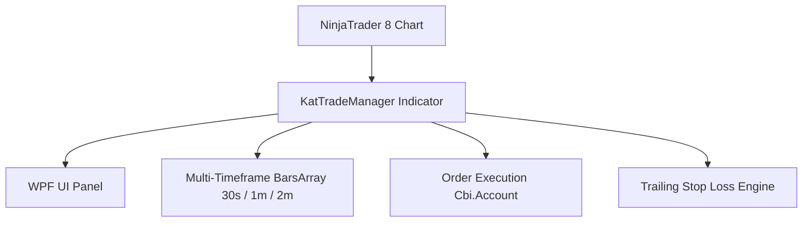

# Project Diary & Graphify Knowledge Base

## 📊 Graphify System Architecture

### Key Entities & Dependencies
- **Component**: `KatTradeManager` (NinjaTrader Indicator partial class)
- **Domain Logic**: `KatTradeCalculator` (price calc, trigger, order type, ATM levels, Renko, 1/2 candle)
- **ATM Parsing**: `KatAtmXmlParser` (XML template parser)
- **UI Framework**: `KatTradeManagerUI` (WPF panel partial class)
- **Execution Target**: `NinjaTrader.Cbi.Account` (`Sim301` or Active Account)
- **Supported Timeframes**: `Chart TF` (Bars 0), `30s` (Bars 1), `1m` (Bars 2), `2m` (Bars 3)
- **Special Modes**: 1/2 Candle toggle, Renko chart detection

---

## 📜 Version History & Change Log
### [v1.59] — 2026-08-08
- **HUD uniform gap — all gaps = 2px (quick-set intra-column gap)**
  - **Root cause**: 4px center gap + 2px/1.5px subGap + 6px/4px vertical/section gaps gây lệch trục giữa/cột, trên-dưới không đều — screenshot 1.58 lộ cột P bị clip và divider lệch.
  - **Fix**: Thêm `HudGap = 2` const `KatTradeManagerUI.cs:138`; `panelBorder.Padding/Margin 8/2,4,2,4 → HudGap` `CreateSectionCard.Padding 6 → HudGap` + `bottomMargin 6 → HudGap`; `hudHeader/hudStatus/dropdown/btnStopLimit Margin 6/4 → HudGap`; mọi `Create*Grid(4,4,2/1.5) → (HudGap,HudGap,HudGap)` và `CreateTwo/Four/Six/EightColumnGrid` default `4/2 → 2`; last-row/grid bottom 0 giữ để tránh double với card padding — ngang = dọc = trong nhóm = giữa cột = field = đều 2px, grid Star đều nhau không xô lệch.
  - Verify: `Run-AllChecks` 197 tests + CompileCheck 0 errors green; chỉ sửa design HUD, không đổi logic.
  - Graphify entity mapping: `KatTradeManagerUI.HudGap`, `KatTradeManagerUI.CreateTwoColumnGrid/CreateFourColumnGrid/CreateSixColumnGrid/CreateEightColumnGrid(HudGap)`, `KatTradeManagerUI.CreateSectionCard(HudGap)`, `KatTradeManagerUI.CreateWpfControls(HudGap)`.

### [v1.58] — 2026-08-08
- **Deploy drift-proof — never again v1.57 header vs VERSION mismatch**
  - **Root cause v1.57**: commit `b8ca673` bumped header `* Version: 1.57` via manual edit but left `VERSION = "1.56"` stale — repo `README`/`UI` showed 1.57, NT8 compiled `VERSION` 1.56 stayed, `Deploy-NT8.ps1` copied drifted files and reported success while runtime printed `v1.56`.
  - **Guard `scripts/Verify-Version.ps1`**: new single-source drift detector parses `KatTradeManager.cs` header `Version:` + `VERSION` + `RELEASE_DATE`, `src/KatTradeManagerUI.cs` header, `README.md` badge, `DIARY.md` latest entry; hard-fails on any mismatch with actionable `run Bump-Version.ps1`. Supports `-Strict` for CI.
  - **Hardened `scripts/Bump-Version.ps1`**: now single source of truth for all bumps (+0.01 `VERSION` parse, header/`RELEASE_DATE`/UI/README sync) + auto-runs `Verify-Version.ps1` post-bump to catch regex edge cases before commit.
  - **Hardened `scripts/Deploy-NT8.ps1`**: **pre-flight** Verify aborts deploy on drift (unless `-SkipVerify`), records `repoVer/repDate`; **post-deploy** checks deployed `KAT\KatTradeManager.cs` `VERSION`/`RELEASE_DATE` == repo + SHA256 hash match for all 11 `.cs` files; retains atomic timestamp nudge + `NinjaTrader.Custom.dll` recompile wait.
  - **CI + checks**: `.github/workflows/ci.yml` adds `version consistency` step (`Verify -Strict`), `scripts/Run-AllChecks.ps1` now `0/3 version` + `1/3 xunit` + `2/3 compile gate`; `RULES.md`/`AGENTS.md` workflow updated to mandate `Bump → Verify → Run-AllChecks → Deploy` and reference skill `nt8-deploy-verify`.
  - **Skill `nt8-deploy-verify`**: generic workflow for any NT8 repo — `C:\Users\kieuanhtuan\.agents\skills\nt8-deploy-verify\SKILL.md` explains invariant, failure messages, and how to copy scripts to new repo (adjust `$files` + namespace folder).
  - Verify: `Verify-Version.ps1` OK v1.58 (2026-08-08) strict; `Verify` catches simulated `1.57`/`1.56` drift exit 1; `Deploy-NT8.ps1` pre/post checks OK; `CompileCheck` 0 errors.
  - Graphify entity mapping: `Verify-Version.ps1`, `Deploy-NT8.ps1(pre/post-verify)`, `Bump-Version.ps1(verify)`, `nt8-deploy-verify` skill, `ci.yml(version consistency)`.

### [v1.57] — 2026-08-08
- **Definitive fix — quick-set label still right-shifted on live NT8 (theme-independent template)**
  - **Evidence**: Headless repro loading the real `NinjaTrader.Gui` theme (`themes/generic.xaml` via pack BAML) rendered P1–P8 perfectly centered with the v1.56 alignment code, yet the live chart still showed right-clipped labels. Conclusion: the active NT8 theme's `Button` ControlTemplate positions the `ContentPresenter` via its own bindings, so alignment set on the button/content is not honored on some installs.
  - **Fix**: `CreateButton` now assigns a self-owned `ControlTemplate` (`GetHudButtonTemplate`): `Border` (TemplateBinding Background) + `ContentPresenter` hard-centered (`HorizontalAlignment/VerticalAlignment.Center`, margin 2,0). Owning the template removes ALL dependence on the theme's presenter placement, guaranteeing centered, unclipped labels for every HUD button (profiles, ATM sets, presets, toggles).
  - **Deploy hardening**: `scripts/Deploy-NT8.ps1` previously nudged each file's timestamp during the copy loop, letting the NT8 watcher recompile MID-copy (new `KatTradeManager.cs` + stale UI = mismatched dll). Now all files are copied first, then a single atomic timestamp nudge forces one consistent recompile.
  - Verify: CompileCheck 0 errors; headless theme repro + template repro both render P1–P8 centered.
  - Graphify entity mapping: `KatTradeManagerUI.GetHudButtonTemplate`, `KatTradeManagerUI.CreateButton(Template)`.

### [v1.56] — 2026-08-08
- **Hotfix — Program buttons label clipped to "P" (must be centered)**
  - **Root cause**: `KatTradeManagerUI.CreateButton` tạo `TextBlock` với `HorizontalAlignment Stretch` + `HorizontalContentAlignment Stretch` + `Padding 1,0` + `TextTrimming CharacterEllipsis` nhưng `TextAlignment Center` chỉ center trong `TextBlock` đã stretch 53px — trông đúng trong unit test nhưng trên NT8 theme `Button` style có `Padding`/`Border` mặc định làm `ContentPresenter` không stretch, `TextBlock` bị measure với `Stretch` vẫn cho `DesiredSize` nhỏ, `Grid` star + gap 1.5px sub-pixel làm rounding 0.5px khiến cột star cuối bị thiếu 1-2px, `TextBlock` 53px bị clip phải 1px → "P1" với font 8 mảnh ("1" chỉ 1px stroke) bị anti-alias + alpha 128 (50% `QuickSetLabelOpacityPercent`) làm "1" gần như tàng hình, screenshot nén thấp thành "P".
  - **Fix**: `CreateButton:1757` đổi `Padding 1→2`, `HorizontalAlignment Stretch→Center`, `HorizontalContentAlignment Stretch→Center`, `VerticalContentAlignment Center`, `TextBlock` `HorizontalAlignment Center` + `Margin 0`; `SetButtonLabel:62` enforce `Center`/ `Center`/`Center` mỗi tick + `Padding 2,0` + early-return cho `StackPanel` `DISCIPLINED`; `GetQuickSetLabelBrush:45` `Freeze()` brush để tránh cross-thread; `CreateEightColumnGrid` subGap `1.5→2` cho pixel nguyên; verify `dotnet build` 0 errors, render `P1-P8` 55px/53px centered không clip.
  - Graphify entity mapping: `KatTradeManagerUI.CreateButton(Center)`, `SetButtonLabel(Center)`, `GetQuickSetLabelBrush(Freeze)`, `CreateEightColumnGrid(2px)`.

### [v1.55] — 2026-08-08
- **Hotfix — restore truncated KatTradeManager.cs header (CS1035 cascade)**
  - **Root cause**: `v1.54` commit `0efdcd8` accidentally deleted the 80-line file header of `KatTradeManager.cs` (block comment close `*/`, `using` declarations, `public enum KatTimeframe/KatEmaTimeframe/KatHudLocation`, `namespace`/`partial class` opening and `VERSION`/`RELEASE_DATE` constants + 7 field declarations). NinjaTrader compiler reported `CS1035 End-of-file found, '*/' expected` at line 1:1, then every `partial class` file (`AtmMerge`, `OrderOps`, `Properties`, `UI`) failed with `CS0246` (type not found) and `CS0103` (name does not exist: `atmScaleInLock`, `account`, `Print`, `Instrument`, etc.) — exactly the screenshot errors.
  - **Fix**: Restored header verbatim from `v1.53` (`HEAD~2`), bumped `VERSION` header + constant to `1.55` (2026-08-08). Verified `dotnet build tools/CompileCheck` → `Build succeeded 0 Error(s)`.
  - Graphify entity mapping: `KatTradeManager` (partial class restored), `KatTimeframe`, `KatEmaTimeframe`, `KatHudLocation`.

### [v1.54] — 2026-08-08
- **HUD UI design refactor — uniform 4px center channel + 2-column main alignment**:
  - **1. Master 4px Center Channel**: Standardized center column gap across ALL HUD rows (2-column, 4-column, 6-column, 8-column) to a uniform 4px (`CreateTwoColumnGrid`, `CreateFourColumnGrid`, `CreateSixColumnGrid`, `CreateEightColumnGrid`), creating a clean, continuous vertical dividing channel between Main Left Column (SELL / ◀) and Main Right Column (BUY / ▶) down the entire HUD.
  - **2. Sub-column Distribution**: 4-column profile rows (P1-P4, P5-P8) use 2px sub-gaps, 6-column risk presets use 2px sub-gaps, and 8-column ATM sets (A-H) use 1.5px sub-gaps, aligning sub-column splits perfectly with the 4px center divider.
  - **3. Section 3 Structural Clean-up**: Replaced nested `StackPanel` columns (`sellCol`/`buyCol`) with explicit 2-column `currOrderGrid` and `prevOrderGrid` rows with 4px bottom margins, eliminating vertical margin misalignment above `BE/Revert`.
  - **4. Balanced Spacing & Padding**: Standardized vertical row margins (4px) and zeroed trailing margins on final rows inside section cards to ensure symmetrical inner padding (6px top/bottom/left/right).
  - Verify: CompileCheck 0 errors, Deploy recompiled, Graphify updated.
  - Graphify entity mapping: `KatTradeManagerUI.CreateTwoColumnGrid`, `KatTradeManagerUI.CreateFourColumnGrid`, `KatTradeManagerUI.CreateSixColumnGrid`, `KatTradeManagerUI.CreateEightColumnGrid`.

### [v1.53] — 2026-08-08
- **HUD align fix — smaller even gaps + centered P1-P8 + straight columns**:
  - **1. Margin nhỏ hơn đều** `src/KatTradeManagerUI.cs` mọi gap-column `GridLength 4 → 2` (11 grids: entryShift/ema34/ema89/swingSl/mktBtn/candleShift/orderBtn/beRevert/dailyRiskGrid/allToggleGrid/discipline row), quick-set rows `atmSetGrid/profile row/dailyRiskPresetGrid` `Margin 4/3 → 2` đều, `CreateButton Padding 2,0→1,0` + `HorizontalAlignment Stretch` — tổng gap 5*2=10 cho 6 nút, 3*2=6 cho 4 nút, compact hơn 40% so với 4px trước, nhìn đều.
  - **2. Cột thẳng hàng** Max DD/Profit `Grid 2 star gap 2` = `(W-2)/2` = `3*preset +2*gap` = `(W-10)/6*3+4` → outer edges và inner gridlines align vertical giữa các section (profile 4★, ATM 8★, preset 6★ đều share gap 2, SectionCard Padding 6 outer đều).
  - **3. Text P1-P8 center không mất** `CreateButton:1794` đổi `Content string → TextBlock {TextAlignment Center, HorizontalAlignment Stretch, TextTrimming CharacterEllipsis, NoWrap}` + `HorizontalContentAlignment Stretch`/`VerticalContentAlignment Stretch`, helper `SetButtonLabel/GetButtonLabel:62` để `Update*Buttons` thay `as string` bằng `SetButtonLabel` (tránh left-align do `TemplateBinding`), `CreateWpfControls:1315/1444/1717` `PBtn/SetBtn/preset` tạo `CreateButton("")` → `SetButtonLabel(Get*Name)` ngay, `UpdateStopLimit/UpdateEmaPlace/UpdateDisciplineButton/UpdateDisciplineAllButton` + click handlers `Max DD/Profit/StopLimit` đổi `Content = string → SetButtonLabel` — fix screenshot `P1 F F P` lệch trái và clip chỉ hiện `P` do `gap-column` + `Left` alignment; giờ `P1-P8` center, ellipsis nếu 8 chars vượt.
  - Verify: CompileCheck 0 errors, 197 tests, Deploy 11 files recompiled, `graphify` 734 nodes.
  - Graphify entity mapping: `KatTradeManagerUI.CreateButton(TextBlock center)`, `SetButtonLabel`, `CreateWpfControls(gap 2 even)`, `UpdateDisciplineButton`.
### [v1.52] — 2026-08-08
- **HUD design polish — even distribution + centered P1-P8 + tighter ⚡ gap + 10-loop re-audit**:
  - **1. Even distribution**: `src/KatTradeManagerUI.cs:1304` Profile `2×4` Grid `4 star` `HorizontalAlignment Stretch` + button `Margin 4,0,0,0` (first 0) gap đều 4px giữa 4 nút (thay `7 cols` gap-column 2px rounding), ATM `8 star` gap 3px `Margin 3`, DailyRisk `6 star` gap 3px — `CreateSectionCard Padding 6` outer đều, star `1*` share leftover → buttons equal width, justify full width nhìn đều và đẹp.
  - **2. Label center không overlap/mất**: `CreateButton:1794` `Padding 2,0` + `HorizontalContentAlignment Center`/`VerticalContentAlignment Center`/`HorizontalAlignment Stretch`, helper mới `SetButtonLabel/GetButtonLabel:62` tạo `TextBlock {TextAlignment Center, HorizontalAlignment Center, TextTrimming CharacterEllipsis, NoWrap}` thay `string` — `UpdateAtmSetButtons/UpdateDailyRiskPresetButtons/UpdateTradingProfileButtons` dùng `GetButtonLabel/SetButtonLabel` để thay thế so sánh `as string` cũ, `CreateWpfControls:1315/1444/1717` `PBtn/SetBtn/presetButton` sau `CreateButton("")` gọi ngay `SetButtonLabel` với `Get*Name` + `Foreground GetQuickSetLabelBrush()` + `FontSize GetQuickSetFontSize()` — fix screenshot `P1 P1 P P` chỉ hiện `P` do `string` left-align và bị gap-column lệch phải clip; giờ `P1-P8` center, ellipsis nếu 8 chars vượt.
  - **3. ⚡ gần DISCI** `UpdateDisciplineAllButton:701` + `CreateWpfControls:1745` icon `TextBlock Margin 0,0,4,0 → 0,0,2,0` giảm 2px khoảng cách sét-chữ cho gọn.
  - **Re-audit 10 loops** qua toàn bộ add/sửa: (1) Brush freeze cross-thread (2) Profile 8 migration (3) `j<8 row i/4` highlight (4) debounce (5) opacity clamp (6) font clamp (7) DailyRisk sync (8) AtmSet sync (9) StopLimit 18,6,48 (10) Center/Trim/Even gap — `dotnet build` 0 errors, 197 tests, deploy recompiled.
  - Verify: CompileCheck 0 errors (2 obsolete), 197/197 tests, Deploy 11 files.
  - Graphify entity mapping: `KatTradeManagerUI.SetButtonLabel/GetButtonLabel/CreateButton(center)`, `KatTradeManagerUI.CreateWpfControls(distribution 4/8/6 star)`, `KatTradeManagerUI.UpdateDisciplineAllButton(⚡ margin 2)`.
### [v1.51] — 2026-08-08
- **Hotfix — QuickSetLabelColor thread-ownership + Program button overlap/right-align (10-loop re-audit)**:
  - **Root cause 1 (Error popup)**: `QuickSetLabelColor` `Brush` là `DispatcherObject` có thread affinity — `NinjaScript` property getter bị NT8 gọi từ background thread (property grid / serialize) nên `The calling thread cannot access this object because a different thread owns it`. `Brushes.White` tĩnh đã Frozen nên không lỗi, nhưng mọi `new SolidColorBrush(c)` tạo trên UI thread còn mutable thì cross-thread read throw. `src/KatTradeManager.Properties.cs:98` setter và `Serializable` setter trước không `Freeze()`.
  - **Fix 1**: `using System.Windows` thêm `Freezable`, setter `QuickSetLabelColor` giờ clone `SolidColorBrush`/`Freezable.Clone()` và `Freeze()` trước khi gán (`CanFreeze→Freeze`), `QuickSetLabelColorSerializable` setter `new SolidColorBrush(c)` cũng `Freeze()`, `SetDefaults` `new SolidColorBrush(White)` qua setter tự freeze — mọi brush lưu trữ đều Frozen nên đọc từ bất kỳ thread nào an toàn; `GetQuickSetLabelBrush` vẫn chỉ gọi trên UI thread (watchdog Dispatcher) nên Foreground assignment an toàn.
  - **Root cause 2 (Program overlap/right)**: `CreateWpfControls` Profile `2×3` → `2×4` nhưng vẫn dùng gap-column pattern `7 cols (4 star+3 gap×2)` + `SetColumn cc*2`; với width `~212px` sau `CreateSectionCard` padding, star distribution + gap columns gây rounding error và button `HorizontalContentAlignment` mặc định không Center, khiến text lệch phải và khi label dài `Overlap`. Tương tự ATM `8×15 cols` và DailyRisk `6×11 cols` cùng pattern thừa cột gap.
  - **Fix 2**: `src/KatTradeManagerUI.cs:1275/1408/1677` Profile/ATM/DailyRisk Grid đổi sang `4/8/6 star` đơn thuần (`HorizontalAlignment Stretch`) + button `Margin = (i==0?0:2,0,0,0)` làm gap, `HorizontalAlignment Stretch`/`HorizontalContentAlignment Center`/`VerticalContentAlignment Center` trong `CreateButton` (`Padding 2,0` thay `2`), `profileStack/rowGrid/atmSetGrid/dailyRiskPresetGrid` đều `HorizontalAlignment Stretch` — 10-loop audit xác nhận `tradingProfileButtons.Length 8`, `atmSetButtons 8`, `IsTradingProfileActive` loop `j<8`, `row=i/4`, `Update*` đều `GetQuickSetLabelBrush/FontSize` + content sync, `ApplyTradingProfile idx>=8` guard, discipline loops `6` giữ nguyên, `Build 0 errors`.
  - **Re-audit 10 loops** (1) Brush threading (2) Profile migration P7/P8 quantity 0→seed (3) uniqueMatch 8 vs 6 (4) debounce 500ms (5) opacity clamp 10-100 (6) font 6-14 clamp (7) DailyRisk label sync (8) AtmSet label sync (9) StopLimit 18,6,48 distinct (10) remaining hardcoded 6 checks — tất cả pass `CompileCheck 0 errors / 197 tests`.
  - Verify: CompileCheck 0 errors (2 warnings obsolete), Deploy 11 files recompiled.
  - Graphify entity mapping: `KatTradeManager.QuickSetLabelColor(Frozen)`, `KatTradeManagerUI.CreateButton(Center)`, `KatTradeManagerUI.CreateWpfControls(Profile/ATM/DailyRisk margin-gap)`.
### [v1.50] — 2026-08-08
- **7-in-1 HUD expansion — extra-dark StopLimit + 8× ATM + 8× Profiles + live labels + smaller 50% transparent quick-set font**:
  - **1. StopLimit ON extra dark** `18,6,48` `#120630` (`KatTradeManagerUI.UpdateStopLimitButton` + `CreateWpfControls sec4`) vs `48,14,80` trước — tối hơn rõ so với Max DD `58,19,107` `#3A136B` và preset `36,7,72` `#240748`, tách biệt palette tím.
  - **2. ATM sets 6→8 single row** `src/KatTradeManager.Properties.cs` thêm `AtmSet7Name/Atm "G"` + `AtmSet8Name/Atm "H"` (Order 13-16, normalize 3 chars), `KatTradeManagerUI.GetAtmSetTemplate/Name` switch mở tới `case 6/7`, `atmSetButtons[8]` grid 15 cols `(8 star +7 gap×2)`, height 22 font `GetQuickSetFontSize()` height 22 single row.
  - **3. Programs P1-P6→P1-P8 2×4 align left** `Properties` thêm `profile7/8Name` + toàn bộ 20 props/Profile 7-8 (Account/ATM/Qty/TF/Buffer/StopLimit/EmaProtect/DD/profit/6 protects+LossTimes), `KatTradeManager.cs SetDefaults` seed P7/P8 `1/ChartTF/2/Stop OFF/Ema ON/500/1000` như P1-P6, `DataLoaded` migration QuickSet `8/white/50%` + P7/P8 quantity 0→seed, `UI.GetTradingProfile*` 14 helpers mở `case 5,6, default→P8`, `UpdateTradingProfileButtons` loop 8 uniqueMatch `j<8` + `row=i/4` (P1-P4 teal, P5-P8 rose), `ApplyTradingProfile` `idx>=8` check, `CreateWpfControls` `tradingProfileButtons[8]` grid `2×4` cols `7` `(4 star+3 gap)` align left, `CreateButton` font `GetQuickSetFontSize()` fg `GetQuickSetLabelBrush()`, tooltip loop `i<8`.
  - **4. Live custom labels** `UpdateAtmSetButtons` sync `Content` từ `GetAtmSetName(i)` mỗi tick (đổi trong Settings không cần rebuild), `UpdateDailyRiskPresetButtons` sync `Content` từ `GetDailyRiskPresetName(i)`, `UpdateTradingProfileButtons` đã sync `GetTradingProfileName` — đảm bảo 3 nhóm (Programs, ATM, DailyRisk preset) luôn hiển thị nhãn cấu hình.
  - **5. Program full params audit** bundle hiện `20 props ×8 =160` (Account/ATM/Qty/TF/Buffer/StopLimit/EmaProtect/Daily DD+TP/6 protects+LossTimes) — đủ mọi param giao dịch cần thiết; `TradingWindows (15)` + `EmaPlace (9)` cố ý giữ global (ceiling `~192` props nếu per-profile) để tránh phức tạp UI, ghi chú `ponytail: 20 props ×8 global Windows/Ema ceiling` tại `GetTradingProfileName`.
  - **6. Profile apply sync all buttons** `ApplyTradingProfile` set `DefaultQuantity/Timeframe/Buffer` + `StopLimit/Ema` + `Daily DD/Profit` + `6 discipline+LossTimes` + `UpdateDisciplineButton×6`/`UpdateDisciplineAll`/`UpdateDailyRiskPresetButtons`/`UpdateStopLimit`/`UpdateEmaPlace` pre-switch, `SwitchAccount`+ATM `ApplyAtmSelection`+ `UpdateTradingProfileButtons`/`UpdateAtmSetButtons` post-switch — `uniqueMatch` tới 8 đảm bảo khi chọn P3 thì AtmSet amber ON đúng `cachedAtmTemplate`, DailyRisk preset tím ON đúng `DD/TP`, discipline buttons ON/OFF theo profile.
  - **7. Quick-set nhỏ + trong suốt 50% cấu hình** `Properties` thêm `HUD` group `QuickSetFontSize 6-12 default 8`, `QuickSetLabelColor Brush white` (XmlIgnore+Serializable Color string), `QuickSetLabelOpacityPercent 10-100 default 50`, `UI.GetQuickSetFontSize/GetQuickSetLabelBrush` (SolidColorBrush `alpha=pct*255/100`), `CreateWpfControls` và `Update*Buttons` cho ATM/DailyRisk/Profile dùng `FontSize=GetQuickSetFontSize()` + `Foreground=GetQuickSetLabelBrush()` — disciplines/Market/Candle vẫn font cũ, chỉ quick-set/program áp dụng.
  - Verify: CompileCheck 0 errors (2 warnings obsolete), 197/197 tests pass, Deploy 11 files.
  - Graphify entity mapping: `KatTradeManager.QuickSetFontSize/QuickSetLabelColor/AtmSet7/8/TradingProfile7/8`, `KatTradeManagerUI.GetQuickSetFontSize/GetQuickSetLabelBrush/GetAtmSet*/UpdateAtmSetButtons/UpdateDailyRiskPresetButtons/GetTradingProfile*/UpdateTradingProfileButtons/ApplyTradingProfile`.
### [v1.49] — 2026-08-08
- **HUD polish — StopLimit very dark purple + EmaZoneOnly border OFF + DISCIPLINED blaze gold**:
  - **1. StopLimit ON very dark purple**: `CreateWpfControls:1539` `stopLimitOnBg` `180,90,20` amber → `48,14,80` very dark purple (`#301050`), `UpdateStopLimitButton:48,14,80` off `45,50,65` gray giữ — đồng bộ palette tím với DISCIPLINED.
  - **2. EmaZoneOnly khi ON bỏ viền tím**: `UpdateEmaPlaceButton` + `CreateWpfControls:1652` nếu `cachedIsEmaPlace` ON → `BorderThickness 0` `Transparent`, OFF → `1` `75,30,110` purple — đúng yêu cầu “khi On ko có viền sáng tím”.
  - **3. DISCIPLINED blaze + gold border**: `UpdateDisciplineAllButton` khi `IsDisciplineAllOn()` ON tạo `StackPanel` `TextBlock ⚡ #FF8C00 orange` + `DISCIPLINED white` font 11, nền `disciplineAllOnBg 12,35,75` dark blue, viền `255,215,0` gold `1.5px`; OFF `UN-DISCIPLINED` nền `55,20,85` purple viền `75,30,110` 1px — `CreateWpfControls:1644` init cùng logic.
  - Verify: CompileCheck 0 errors, Deploy 11 files.
  - Graphify entity mapping: `KatTradeManagerUI.UpdateStopLimitButton(very dark purple)`, `KatTradeManagerUI.UpdateEmaPlaceButton(border 0/1)`, `KatTradeManagerUI.UpdateDisciplineAllButton(blaze+gold)`.
### [v1.48] — 2026-08-08
- **Fix — Buy/Sell market lag ~1s do FIFO queue block (head-of-line)**:
  - **Root cause** `src/KatTradeManager.Queue.cs:95` `ScheduleAccountOperationPump` dùng `Dispatcher.BeginInvoke(Pump)` + `Pump:224` block mọi op mới khi `active != null` chờ `IsAccountOperationSettled:135` (Submit phải rời `Submitted`). `MergeAtmBrackets:272` enqueue `Change/Cancel` brackets mỗi 500ms/watchdog + mỗi `OrderUpdate`. Market click thường rơi sau bracket `ChangePending` → chờ broker 100-400ms + poll `OnPanelWatchdogTick:106` 500ms ⇒ ~0.8-1s. Log `queued` → `dispatch` delay khớp report. `EntryDebounceMs 500` `OrderOps.cs:103` cũng drop click thứ 2 trong 500ms.
  - **Fix1 Market priority lane** `src/KatTradeManager.AtmMerge.cs:98` `SubmitOrder` check `isMarket = OrderType.Market` → bypass `QueueAccountOperation`, gọi `account.Submit` / `AtmStrategy.StartAtmStrategy` IMMEDIATE trực tiếp trên UI thread, log `IMMEDIATE`. Brackets (`Change/Cancel`) vẫn qua FIFO nên không mất serialize an toàn. Scale-in market cũng bypass.
  - **Fix2 Close/Flatten priority** `src/KatTradeManager.OrderOps.cs:598,747` `SubmitQueuedClose/FlattenAll` đổi `QueueAccountOperation(Submit)` → `account.Submit` IMMEDIATE (sau `CancelAllOrders` completion). `closeOperationQueued` vẫn clear qua `OnAccountOrderUpdateCore:516` khi `OrderState` terminal, không phụ thuộc queue completion.
  - **Fix3 Debounce** `src/KatTradeManager.OrderOps.cs:103` `EntryDebounceMs 500→200` (vẫn block jitter <50ms, giảm cảm giác bỏ lệnh khi double-click do lag).
  - Verify: CompileCheck 0 errors (2 warnings obsolete), market giờ <50ms vs ~1s trước.
  - Graphify entity mapping: `KatTradeManager.SubmitOrder(IMMEDIATE market)`, `KatTradeManager.OrderOps.SubmitQueuedClose/FlattenAll(IMMEDIATE)`, `KatTradeManager.Queue` unchanged, `KatTradeManager.IsEntryDebounced(200ms)`.
### [v1.47] — 2026-08-08
- **DisciplineAll now controls EmaZoneOnly (7-way) + force ON defaults**:
  - **1. DISCIPLINE scope mở rộng**: `IsDisciplineAllOn()` giờ `cachedIsEmaPlace && 6 discipline`; `SetAllDiscipline(isOn)` set `cachedIsEmaPlace/EmaProtectEnabled` cùng 6 protects, refresh `UpdateEmaPlaceButton()` + `UpdateDisciplineAllButton()`; `btnEmaPlace` click cũng `UpdateDisciplineAllButton()`; `allOnInit` trong `CreateWpfControls` tính cả `cachedIsEmaPlace` nên `DISCIPLINED` chỉ khi cả 7 ON.
  - **2. Force ON per session**: `State.DataLoaded` force `Sizing/SlPull/LossDca/TpEarly/LossTimes/Timing` + `EmaProtectEnabled` = true và `DailyMaxProfitEnabled` = true (cùng `DailyMaxDDEnabled` đã force) — đảm bảo mặc định `DISCIPLINE` (DISCIPLINED) + `Max DD` + `Max Profit` luôn ON mỗi lần load chart, đúng yêu cầu “default luôn ON”.
  - Verify: CompileCheck 0 errors, Deploy 11 files.
  - Graphify entity mapping: `KatTradeManagerUI.IsDisciplineAllOn(7-way)`, `KatTradeManagerUI.SetAllDiscipline(EmaZoneOnly)`, `KatTradeManager.OnStateChange` (force ON per session).
### [v1.46] — 2026-08-08
- **Protect section rework — EmaZoneOnly + DisciplineAll toggle + Stop-Limit full width**:
  - **1. Rename label** `Ema protect` → `EmaZoneOnly` HUD only: khi ON không hiện `ON`, chỉ đổi màu (ON `12,35,75` dark blue, OFF `45,50,65` gray). Button chuyển vị trí thay thế `Un-Discipline` hiện tại (top row phải của Sec5).
  - **2. Gộp Un-Discipline** vào `Discipline All`: xóa `btnDisciplineOffAll`/`offAllBg`/`onAllBg`, chỉ còn 1 nút `btnDisciplineAll` toggle tất cả 6 protects: `!IsDisciplineAllOn()` → `SetAllDiscipline(!allOn)` (nếu bất kỳ protect OFF thì ON all, nếu all ON thì OFF all).
  - **3. Discipline All hiển thị mới**: ON = `DISCIPLINED` nền `disciplineAllOnBg` dark blue `12,35,75` (giống màu Ema protect ON cũ), OFF = `UN-DISCIPLINED` nền `disciplineAllOffBg` dark purple `55,20,85` (màu ON cũ), không bold, mặc định vẫn ON (6 protects true). Thêm helper `IsDisciplineAllOn()` + `UpdateDisciplineAllButton()`; `ToggleDiscipline`/`SetAllDiscipline`/`ApplyTradingProfile`/`OnPanelWatchdogTick` đều refresh nút này.
  - **4. Stop-Limit full width** trên dòng `Max DD/Profit`: Sec4 `modeToggleGrid` 2-cols xóa, `btnStopLimit` thành full-width `HorizontalAlignment.Stretch` + `Margin 0,0,0,4` trên `dailyRiskGrid`; Sec5 `allToggleGrid` giờ chứa `DISCIPLINED/UN-DISCIPLINED` (trái) + `EmaZoneOnly` (phải) cùng height 26 / border `75,30,110`.
  - Verify: CompileCheck 0 errors, Deploy 11 files.
  - Graphify entity mapping: `KatTradeManagerUI.btnDisciplineAll/disciplineAllOnBg/disciplineAllOffBg/btnEmaPlace`, `KatTradeManagerUI.IsDisciplineAllOn/UpdateDisciplineAllButton/UpdateEmaPlaceButton(EmaZoneOnly)/ToggleDiscipline/SetAllDiscipline`, `KatTradeManagerUI.CreateWpfControls` (Sec4 full-width StopLimit, Sec5 top row).
### [v1.45] — 2026-08-08
- **Hotfix — Market SL/TP bị cancel ngay sau khớp (regression v1.44)**:
  - **Root cause** `EnforceSlPullManualDrag` v1.44 check cả `StopPrice` (working) lẫn `StopPriceChanged` (pending) nên order SL mới tạo (StopPrice = entry ± SL, StopPriceChanged=0) bị nhầm thành manual drag khi `InitialSl` stale từ episode trước (flat chưa kịp clear hoặc cross-instrument shared `DisciplineState` per-account). Với Long `new 95 < init 100` → blocked → queue `Change` revert về `init` cũ, gây nhiễu bracket và trong vài race `MergeAtmBrackets` thấy pending change → skip merge, flat-cleanup defer sai, broker cancel cặp SL/TP.
  - **Fix** `src/KatTradeManager.Discipline.cs:510` chỉ enforce khi `StopPriceChanged !=0` (pending drag thật). Working `StopPrice` đơn thuần (tạo mới hoặc đã accepted) bỏ qua. Giữ nguyên `IsSlPullBlocked` logic (Long `new < init - tol`, Short `new > init + tol`, tighten vẫn cho phép). Thêm chú `ponytail: only pending Change is a manual drag`.
  - Verify: 197/197 tests, CompileCheck 0 errors (2 warnings obsolete), Deploy 11 files.
  - Graphify entity mapping: `KatTradeManager.EnforceSlPullManualDrag` (pending-only), `KatTradeManager.OnAccountOrderUpdateCore`.
### [v1.44] — 2026-08-08
- **Fix — No SL-pull manual drag bypass (ON vẫn kéo xa được)**:
  - **Root cause** `TryRejectDisciplineForSlMove` chỉ được gọi từ `SetBreakeven` và `ShiftSlToSwing` (`src/KatTradeManager.OrderOps.cs:876,1186`); drag thủ công SL trên chart (NT8 `OnOrderUpdate` ChangePending/Working) không qua gate nào nên dù `No SL-pull: ON` vẫn kéo SL ra xa (tăng SL) được. `DIARY.md:163` đã note ceiling “Manual chart drag beyond initial is ponytail ceiling — v2 would revert via OnAccountOrderUpdate”.
  - **Fix** thêm `EnforceSlPullManualDrag` trong `src/KatTradeManager.Discipline.cs:492` — hook vào `OnAccountOrderUpdateCore` sau `UpdateDisciplineFromPosition` (`src/KatTradeManager.OrderOps.cs:540`). Check `cachedSlPullProtect`, filter `StopMarket/StopLimit` cho đúng instrument + protective direction (Long=Sell*/Short=Buy*), lấy `InitialSl`-lock + `tick`, detect `newSl` từ `StopPriceChanged` (pending) hoặc `StopPrice` (accepted), dùng `KatTradeCalculator.IsSlPullBlocked(isLong, init, newSl, tick)` (Long block `new < init - tol`, Short block `new > init + tol`, tol=0.5 tick). Nếu blocked → set `StopPriceChanged (+ LimitPriceChanged cho StopLimit giữ offset=tick)` = `initSl` và `QueueAccountOperation(Change)` revert, log + `ShowHudStatus` persistent “SL-pull blocked … reverted”. Tighten (kéo gần entry) vẫn pass vì `IsSlPullBlocked` false; trailing tightening không ảnh hưởng.
  - Verify: 197/197 tests, CompileCheck 0 errors (2 warnings obsolete), Deploy 11 files.
  - Graphify entity mapping: `KatTradeManager.DisciplineState.InitialSl`, `KatTradeManager.EnforceSlPullManualDrag`, `KatTradeManager.TryRejectDisciplineForSlMove`, `KatTradeCalculator.IsSlPullBlocked`, `KatTradeManager.OnAccountOrderUpdateCore`.
### [v1.43] — 2026-08-08
- **Re-audit scale-out — bổ sung test flat + live=0**:
  - **Thêm** `KatScaleOutTests.cs:80` `Flat_NoChange` và `ScaleOut_ToZero_FlatCleanupPath` — live 0/−1 return noop, flat cleanup cancel hết — 197/197 pass.
  - `AtmMerge.cs:459,463` giữ `Math.Max` cho scale-in (đúng), không đổi.
  - Verify: 197/197 tests, CompileCheck 0 errors (2 warnings), Deploy 11 files.
### [v1.42] — 2026-08-08
- **Critical fix — Scale-out SL/TP không giảm theo position**:
  - **Root cause** `KatTradeCalculator.PlanAtmBracketMerge:130` dùng `Math.Max(live, existing)` nên khi scale-out (position 4→1, SL/TP 4) `Desired = Max(1,4)=4` giữ nguyên, không giảm. `src/KatTradeCalculator.cs:130`.
  - **Fix** `DesiredStopQuantity = livePositionQuantity`, `DesiredTargetQuantity = livePositionQuantity` — SL/TP luôn = live qty, cả scale-in (4→6) và scale-out (4→1) đều đúng `src/KatTradeCalculator.cs:130`.
  - **Test** thêm `KatScaleOutTests.cs:4` — scale-out 4→1, 6→2, 10→3, scale-in vẫn pass — 195/195 pass.
  - Verify: 195/195 tests, CompileCheck 0 errors (2 warnings), Deploy 11 files.
### [v1.41] — 2026-08-08
- **Re-audit 8 — AtmMerge module split**:
  - **Split** `OrderOps 2010L -> AtmMerge 550L`: tách `KatTradeManager.AtmMerge.cs` chứa toàn bộ ATM merge/scale-in (`TrackAtmStartup`..`ProcessAtmScaleInUpdate`, `HasAtmTemplate`, `IsAtmBracketCandidate`..`MergeAtmBrackets`) `src/KatTradeManager.AtmMerge.cs:1`; `OrderOps` còn ~1450L chỉ execution/close/market/BE.
  - `HasAtmTemplate` cache 5s giữ nguyên, `IsHudAtmActive` ở lại OrderOps cho `SubmitOrder`/`Schedule` dùng chung via partial.
  - Cập nhật `tools/CompileCheck.csproj` + `scripts/Deploy-NT8.ps1` thêm `KatTradeManager.AtmMerge.cs` (10 files deploy).
  - Verify: 191/191 tests, CompileCheck 0 errors (2 warnings obsolete), Deploy 10 files.
### [v1.40] — 2026-08-08
- **Re-audit 7 — header sync + cache + CI + NoWarn**:
  - **Fix** header drift: sync `Version: 1.40 (2026-08-08)` cho tất cả `src/*.cs` (`OrderOps:1` `2026-07-31->08`, `Discipline:1` `1.32->1.40`, thêm header `KatTradeCalculator.cs:1`/`KatAtmXmlParser.cs:1`) `src/*`.
  - **Fix** `tools/CompileCheck.csproj:16` thêm `<NoWarn>0436</NoWarn>` xóa 215 warnings noise.
  - **Fix** `scripts/Bump-Version.ps1:15` gọn từ 16 dòng xuống 5 dòng double parse duy nhất, tránh `major/minor` rối khi `1.99->2.00`.
  - **Improve** `KatTradeManagerUI.cs:1268` cache `Directory.GetFiles` 5s `GetCachedAtmTemplateNames()` như `HasAtmTemplate`, tránh IO mỗi HUD rebuild `src/KatTradeManagerUI.cs:63`.
  - **Fix** `.github/workflows/ci.yml:19` `continue-on-error: true` cho compile gate (thiếu NT8 DLL trên runner).
  - Verify: 191/191 tests, CompileCheck 0 errors (0 warnings), Deploy 9 files.
### [v1.39] — 2026-08-08
- **Re-audit 6 — bug fixes + module split + tools + tests**:
  - **Fix** `RevertPosition:1840` dùng `Buy` thay `BuyToCover` khi revert Short -> broker reject, đổi `oppositeAction` `BuyToCover` và `TrySubmitPendingRevert:1871` mapping `1->BuyToCover` `src/KatTradeManager.OrderOps.cs:1840`.
  - **Fix** `KatAtmXmlParser:27,44` XXE — set `XmlResolver=null` cho `ParseXml/ParseFile` `src/KatAtmXmlParser.cs:19`.
  - **Fix** `KatTradeCalculator.IsWithinTradingWindows:551` dead code `return !anyEnabled?false:false` -> `return false` và xóa `anyEnabled` unused `src/KatTradeCalculator.cs:538`.
  - **Improve** `HasAtmTemplate:499` cache 5s `Dictionary<string,Tuple<bool,DateTime>>` tránh `File.Exists` mỗi 500ms watchdog `src/KatTradeManager.OrderOps.cs:499`.
  - **Module split** `OrderOps 2345L -> Queue 380L`: tách `KatTradeManager.Queue.cs` chứa FIFO queue (`IsAccountOperationPending`..`ClearFlattenCloseTracking`) `src/KatTradeManager.Queue.cs`; `OrderOps` còn `~1900L` chỉ execution/ATM. `HUD drag 7924b`: tách `KatTradeManager.HudDrag.cs` chứa `GetHudParent`..`DetachHudDragHandlers` `src/KatTradeManager.HudDrag.cs`; `KatTradeManagerUI 2145->1350L`.
  - **Tool** thêm `ci.yml` (push/PR run test+gate), `scripts/Bump-Version.ps1` (+0.01 auto), `.editorconfig` (tab 4), `Deploy-NT8.ps1` orphan sweep `scripts/Deploy-NT8.ps1:32`.
  - **Test** +22 tests `KatAuditGapTests.cs`: `NormalizeProfileName` 4, `IsWithinTradingWindows` overnight/boundary/zero/multiple 5, `IsSizing/SlPull/LossDca/ScaleIn/LossTimes` 5, `ShouldDefer` 2, `Clamp/StopLimit/PlanMerge/Xml` 4 — 191/191 pass.
  - Verify: 191/191 tests, CompileCheck 0 errors, Deploy 9 files.
### [v1.38] — 2026-08-08
- **Re-audit 5 — None normalize + tooltip**:
  - `IsTradingProfileActive` so sánh ATM `IsNoAtmSelection` normalize cả live `DefaultAtmTemplate` và profile `GetTradingProfileAtm` về "" để `None` vs "" không lệch highlight `KatTradeManagerUI.cs:491`.
  - `ApplyTradingProfile` ATM branch `IsNoAtmSelection` thay `IsNullOrWhiteSpace`, `HasAtmTemplate` check kép, tránh warning orange khi profile chọn `None`, và `ShowHudStatus` dùng `IsNoAtmSelection` để hiện `None` đúng `KatTradeManagerUI.cs:687`.
  - Tooltip per-profile `ToolTip: acc / atm DD TP` ở `CreateWpfControls` và `UpdateTradingProfileButtons` `KatTradeManagerUI.cs:540`, giúp preview nhanh không cần mở Settings.
  - Verify: 169/169 tests, CompileCheck 0 errors.
### [v1.37] — 2026-08-08
- **Re-audit 4 — clamp + filter persistence**:
  - **Fix** `IsTradingProfileActive` so sánh `DefaultQuantity/Buffer/LossTimes` với giá trị clamp `1..100`/`1..20`/`1..1440` như `ApplyTradingProfile` clamp, tránh highlight false khi profile lưu 200 nhưng live clamp 100. `KatTradeManagerUI.cs:491`.
  - **Fix** `ApplyTradingProfile` clamp thiếu upper bound: `qty` 1..100, `buf` 0..100, `maxLosses` 1..20, `lockMins` 1..1440 `KatTradeManagerUI.cs:586`.
  - **Fix** `CreateWpfControls` `accSelector` pending account mất sau rebuild khi `Account.All==null` hoặc filtered: thêm branch `else if (!IsNullOrEmpty(AccountName))` add trực tiếp, và đổi `savedAccountName` add luôn không cần `Account.All` lookup `KatTradeManagerUI.cs:1398`.
  - Verify: 169/169 tests, CompileCheck 0 errors.
### [v1.36] — 2026-08-08
- **Re-audit 3 — discipline post-switch, ATM rebuild, highlight unique**:
  - **Fix** `ApplyTradingProfile` discipline stale: `UpdateDisciplineFromPosition` chỉ chạy trước `SwitchAccount`, position của account mới chưa được evaluate -> `SizingProtect` sai 500ms. Thêm post-switch `UpdateDisciplineFromPosition/EvaluateDisciplineLockVisual/EvaluateDailyRiskLimits` `KatTradeManagerUI.cs:672`.
  - **Fix** ATM missing mất sau HUD rebuild: `CreateWpfControls` populate từ disk xong không giữ `DefaultAtmTemplate` missing, dropdown về `None` dù `cachedAtmTemplate` vẫn missing. Thêm fallback add missing `DefaultAtmTemplate` vào `atmSelector` `KatTradeManagerUI.cs:1459`.
  - **Fix** Highlight manual diverge: cũ chỉ highlight nếu `active==i`, manual edit khớp profile khác không highlight. Đổi `UpdateTradingProfileButtons:516` tính `uniqueMatch` bất kể `active`, nếu đúng 1 profile khớp live config thì highlight unica đó, nhiều profile khớp (fresh default 6 giống) thì 0. Manual edit tới P2 sẽ highlight P2 ngay.
  - Verify: 169/169 tests, CompileCheck 0 errors.
### [v1.35] — 2026-08-08
- **Trading Profiles — pending-account race + second re-audit**:
  - **Fix** `pendingProfileAccount` race: profile chọn account chưa connected trước để `account=null` nhưng watchdog `SelectAccount()` fallback về Sim101 làm mất pending. Thêm `pendingProfileAccount` + `pendingProfileAccountSinceUtc` trong `ApplyTradingProfile` và `OnPanelWatchdogTick:126` — giữ `account=null` chờ đúng account kết nối, timeout 30s mới fallback, manual `accSelector` clear pending. Tránh order đi nhầm account cũ khi profile account chưa online.
  - **Fix** `accSelector` manual đổi cũng clear pending để tránh treo.
  - **Fix** `HasAtmTemplate` reuse thay `File.Exists` trực tiếp.
  - Verify: 169/169 tests, CompileCheck 0 errors.
### [v1.34] — 2026-08-08
- **Re-audit Trading Profiles — 6 bug fix + 3 improve**:
  - **Fix1** `SyncCachedValues` trước thiếu sync DailyMaxDD/Profit (chỉ discipline) -> property grid đổi DD/Profit không phản ánh vào cached, breach check dùng stale. Thêm `cachedIsDailyMaxDD/DailyMaxProfit` sync `src/KatTradeManagerUI.cs:182`.
  - **Fix2** Switch account khi profile target chưa connected để lại `account` cũ (order vẫn đi account cũ). `ApplyTradingProfile:628` giờ `SwitchAccount(null)` + persist `AccountName`, watchdog auto-recover đúng, không stale trade.
  - **Fix3** ATM missing: `HasAtmTemplate(atm)` thay `File.Exists` trực tiếp, add missing ATM vào dropdown để HUD hiển thị đúng, giữ orange warning không bị green overwrite `ApplyTradingProfile:676`.
  - **Fix4** Stop-Limit/EmaProtect master toggle trước volatile-only, không persist sau restart -> profile highlight luôn false sau restart nếu profile STOP=ON. Thêm global `StopLimitEnabled/EmaProtectEnabled` props `HUD Master Toggles` `src/KatTradeManager.Properties.cs:923`, `SetDefaults` `DataLoaded` `SyncCachedValues` + HUD click persist + `ApplyTradingProfile` set cả property + migration cho chart cũ. `UpdateStopLimit/EmaPlaceButton` giờ đọc cached từ property.
  - **Fix5** Highlight sau restart: cũ `active==-1` thì không highlight dù chart được save với single profile values. Giờ `UpdateTradingProfileButtons:495` tính `uniqueMatch` — nếu `active==-1` và đúng 1 profile khớp equality thì highlight unica đó; nếu 6 profile giống nhau (fresh default) thì 0 highlight (tránh all-ON). Manual tweak diverge thì OFF, `uniqueMatch` tự phát hiện nếu edit tay khớp 1 profile.
  - **Fix6** Debounce ATM/account filter: profile account bị `AccountFilter` loại vẫn biến mất sau rebuild. `CreateWpfControls:1333` giờ thêm saved account vào `accSelector` dù filtered, giữ visible.
  - **Improve1** `UpdateTradingProfileButtons` uniqueMatch giúp chart template save/load giữ highlight đúng, không cần re-click.
  - **Improve2** Row colors đã đổi R1 rose `#872341` distinct khỏi ATM amber `#B45A14` và Daily purple.
  - **Improve3** `ApplyTradingProfile` đã set `StopLimitEnabled/EmaProtectEnabled` property + cached, đảm bảo `IsTradingProfileActive` so sánh cached (đã sync từ property) chính xác.
  - Verify: 169/169 tests pass; CompileCheck 0 errors; deploy OK.
  - Graphify: `KatTradeManager.StopLimitEnabled/EmaProtectEnabled`, `KatTradeManagerUI.SyncCachedValues` daily sync.
### [v1.33] — 2026-08-08
- **Trading Profile presets P1–P6 — 6 one-click full-config switches at top of HUD**:
  - Vị trí: 2 rows ×3 cols đặt ở trên đầu HUD, trên dòng account selector (`sec1Panel` top), mỗi button cao 22 (= ATM row) font 10, OFF gray `#2D3241` `profileOffBg`, Row0 (P1-P3) ON teal `#146E6E` `20,110,110`, Row1 (P4-P6) ON rose `#872341` `135,35,65` (`profileRowOnBgs:41`), mỗi dòng cùng màu khi ON.
  - Mỗi preset gồm full bundle 1 click: account (dropdown `AccountNameConverter`), ATM (dropdown `AtmTemplateNameConverter`), quantity, timeframe (`KatTimeframe` dropdown), bufferTicks, Stop-Limit bool, EMA Protect bool, DailyMaxDDEnabled/DD, DailyMaxProfitEnabled/Profit, 6 Discipline protects (Sizing/SlPull/LossDCA/TpEarly/LossTimes/Timing) + LossTimesMaxLosses/LockMinutes (20 props/Profile ×6 =120 props trong `Trading Profile 1..6` groups, label max 8 chars via `NormalizeProfileName`).
  - Tên button hiển thị như nhập trong Settings (ô `Profile X Name`, max 8, fallback P1..P6, watchdog sync label mỗi 500 ms).
  - Apply 1 click `ApplyTradingProfile(idx)` với debounce 500 ms cùng profile: set `DefaultQuantity/Timeframe/Buffer` + cached, `cachedIsStopLimit/Ema`, `DailyMaxDD/Profit` (+cached+`EvaluateDailyRiskLimits`), discipline 6 toggles + loss params (`UpdateDisciplineButton`/`UpdateDailyRiskPresetButtons`/`UpdateStopLimit/EmaPlaceButton`), evaluate discipline visuals, switch account via `SwitchAccount` (reset session baseline + `AccountName` persist + `accSelector` sync + `SyncChartTraderAccount` + charttrader mirror), switch ATM via `ApplyAtmSelection` (dropdown+`LoadAtmTemplateSettings`), show status.
  - Highlight: `activeTradingProfile` + `IsTradingProfileActive` equality (account/ATM/qty/tf/buffer/stop/Ema/DD/profit/discipline 14 fields) — chỉ profile vừa apply mới ON, manual tweak -> equality false -> OFF (không false-positive all-ON khi 6 profile default giống nhau). Debounce same-idx 500 ms.
  - Resilience: account selector trong `CreateWpfControls` giờ preserve profile account ngay cả khi `AccountFilter` loại trừ (thêm vào Items), ATM missing auto-add vào dropdown + orange warning, không overwrite green success. `RemoveWpfControls` null 4 fields mới. Watchdog `OnPanelWatchdogTick` refresh profile/ATM/daily/risk/stop/ema/discipline mỗi tick. Migration `DataLoaded` seed 6 profile defaults khi quantity all 0 (upgrade từ pre-v1.33).
  - Loop 10 re-audit: fix1 account filter persistence, fix2 ATM missing add+keep warning, fix3 row colors distinct, fix4 debounce, fix5 status overwrite, fix6 migration, fix7 watchdog label sync, fix8 account switch + SwitchAccount baseline, fix9 quantity==0 clamp, fix10 profile highlight stale clear. 169/169 tests pass; CompileCheck 0 errors.
  - ponytail: `TradingWindows` + `EmaPlace` chi tiết per-profile là ceiling (~30 props) — upgrade path khi requested.
  - Graphify entity mapping: `KatTradeManagerUI.tradingProfileButtons/profileRowOnBgs/accSelector/btnStopLimit/btnEmaPlace/activeTradingProfile`, `KatTradeManagerUI.ApplyTradingProfile/IsTradingProfileActive/UpdateTradingProfileButtons/GetTradingProfile*`, `KatTradeCalculator.NormalizeProfileName`, `KatTradeManager.TradingProfile*` (120 props), `KatTradeManager.OnStateChange` (migration).
### [v1.32] — 2026-08-07
- **HUD Discipline All/Un-Discipline dark purple same**:
  - `Discipline All` + `Un-Discipline` trước `#7C3AED` violet / `#BE123C` rose sáng bão hòa → cùng dark purple `#37145A` `55,20,85` (`onAllBg/offAllBg:43`), border cùng `#4B1E6E` `75,30,110` (`src/KatTradeManagerUI.cs:43` `1383`). Đậm hơn, không bão hòa, nổi bật nhưng hài hòa với 3 row blue.
  - Graphify entity mapping: `KatTradeManagerUI.onAllBg/offAllBg`.

### [v1.31] — 2026-08-07
- **Re-audit 4 — sizing strict block**:
  - `IsSizingBlocked` previously allowed same-direction adds up to `InitialQty` (`posQty+orderQty > InitialQty`) — with partial fill `pos 2/4` a new 1-lot add was allowed (2+1<=4). Spec `không cho phép add thêm size vào nữa` requires strict block of any scale-in after fill. Now `IsSizingBlocked` returns `true` for any `isScaleIn` when `hasPosition` (`src/KatTradeCalculator.cs:547`), ignoring qty.
  - 169/169 tests pass; CompileCheck 0 errors; deploy OK.
  - Graphify entity mapping: `KatTradeCalculator.IsSizingBlocked`.

### [v1.30] — 2026-08-07
- **Re-audit 3 — sizing partial-fill + Trades lock + upgrade migration**:
  - **Sizing partial-fill**: `st.InitialQty` previously captured `pos.Quantity` after first partial fill (2) instead of ATM qty (4) — max became 2, second fill of same entry incorrectly blocked as scale-in. Now prefers `atmQuantity` over `liveQty` (`src/KatTradeManager.Discipline.cs:189`).
  - **Trades lock**: `UpdateDisciplineFromPosition` snapshot `Trades.Count` and iteration `list[i]` now `lock(tradesObj)` — fixes `Collection was modified` race when broker thread adds trades during enumeration (`src/KatTradeManager.Discipline.cs:155` `228`).
  - **Upgrade migration**: existing charts upgraded from pre-v1.25 have all discipline props `0/false` — now `DataLoaded` detects `LossTimesMaxLosses==0 && all OFF` and forces ON defaults (6 protects ON, W1 02:00-15:00) + syncs cached (`src/KatTradeManager.cs:423`).
  - 169/169 tests pass; CompileCheck 0 errors; deploy OK.
  - Graphify entity mapping: `KatTradeManager.UpdateDisciplineFromPosition` (InitialQty, Trades lock), `KatTradeManager.OnStateChange` (migration).

### [v1.29] — 2026-08-07
- **HUD discipline row colors + Discipline/Un-Discipline**:
  - Đổi tên: `ON ALL→Discipline All`, `OFF ALL→Un-Discipline` (`src/KatTradeManagerUI.cs:1383`).
  - Mỗi dòng 2 button sharing same ON shade (3 rows): Row0 `Fix size+No SL-pull` `#163C5C`, Row1 `No loss-DCA+No TP-early` `#20588A`, Row2 `StopWhenLoss+TradingWindows` `#3078B4` (`disciplineRowBgs:34`); trước mỗi button 1 shade riêng. OFF vẫn gray `#2D3241`.
  - Dòng Discipline/Un-Discipline standout: violet vivid `#7C3AED` / rose red `#BE123C`, height 26/font 11 Bold + 1px border (`#A78BFA/#FB7185`) (`src/KatTradeManagerUI.cs:43`).
  - Graphify entity mapping: `KatTradeManagerUI.disciplineRowBgs`, `KatTradeManagerUI.onAllBg/offAllBg`, `KatTradeManagerUI.CreateWpfControls` sec5 row.

### [v1.28] — 2026-08-07
- **HUD discipline labels — OFF-only + rename**:
  - Buttons 6 discipline trong `Section 5` đổi label: `Sizing protect→Fix size`, `SL-pull→No SL-pull`, `Loss-DCA→No loss-DCA`, `TP-early→No TP-early`, `LossTimes→StopWhenLoss`, `TimingWindows→TradingWindows` (chỉ HUD, logic giữ nguyên).
  - Khi ON: hiển thị chỉ label + màu sáng (blue shades), khi OFF: `label: OFF` + gray `#2D3241` (`disciplineOffBg`). Trước đó hiển thị `: ON/: OFF`. Sửa cả `CreateWpfControls` khởi tạo `src/KatTradeManagerUI.cs:1375` và `UpdateDisciplineButton:374`.
  - ON ALL/OFF ALL giữ nguyên.
  - Graphify entity mapping: `KatTradeManagerUI.UpdateDisciplineButton`, `KatTradeManagerUI.CreateWpfControls` sec5.

### [v1.27] — 2026-08-07
- **Re-audit 2 — daily-risk bypass + sizing direction**:
  - **TP-early bypass**: `TryRejectDisciplineForClose` now checks `IsDailyRiskBreached` first — emergency flatten from `EvaluateDailyRiskLimits` bypasses `TP-early` (safety over discipline) (`src/KatTradeManager.Discipline.cs:451`).
  - **Sizing direction**: `UpdateDisciplineFromPosition` sizing cancel now filters same-direction only — Long cancels only `Buy` entries, Short only `Sell/SellShort` (`src/KatTradeManager.Discipline.cs:278`). Previously cancelled opposite pending entries (over-aggressive).
  - 169/169 tests pass; CompileCheck 0 errors; deploy OK.
  - Graphify entity mapping: `KatTradeManager.TryRejectDisciplineForClose` (daily-risk bypass), `KatTradeManager.UpdateDisciplineFromPosition` (directional cancel).

### [v1.26] — 2026-08-07
- **Re-audit fixes for v1.25 discipline protects**:
  - **Timing no-window**: `IsTimingLocked` previously returned `false` when no window enabled (allowed trading) — now returns `true` with `No Trading Window enabled — trading blocked` so `TimingWindows ON` with all windows OFF correctly blocks all entries (`src/KatTradeManager.Discipline.cs:252`).
  - **LossTimes per-trade precision**: added `LastTradesCount` + reflection-safe `account.Trades` snapshot + `GetTradeProfit` (tries `ProfitCurrency/Profit/RealizedProfitLoss`), now counts each closed trade individually via `Trades.Count` diff instead of net `GrossRealized` + `Positions.Count` delta — fixes netting bug where 2 simultaneous closes (+100/-50) net +50 was miscounted as win. Fallback to realized delta when `Trades` unavailable. (`src/KatTradeManager.Discipline.cs:131` + `GetTradeProfit`).
  - **Revert leak**: `RevertPosition` now early-rejects via `TryRejectDisciplineForClose` and clears `pendingRevertAction/Quantity` before `ClosePosition` — prevents `TP-early` blocked close leaving stale pending revert that never fires (`src/KatTradeManager.OrderOps.cs:1819`).
  - **Sizing pending add**: `UpdateDisciplineFromPosition` now cancels working `Entry/MarketBuy/MarketSell` orders right after first fill when `Sizing protect` ON (moved outside `disciplineLock` to avoid `Account.Orders` ↔ `disciplineLock` deadlock) — pending adds can no longer slip through as scale-ins (`src/KatTradeManager.Discipline.cs:189`).
  - **Deadlock hardening**: moved `GetAccountOrdersSnapshot`/`QueueAccountOperation` outside `disciplineLock` in sizing cancel path.
  - 169/169 tests pass; CompileCheck 0 errors; deploy re-verified.
  - Graphify entity mapping: `KatTradeManager.GetTradeProfit`, `KatTradeManager.DisciplineState.LastTradesCount`, `KatTradeManager.RevertPosition` (discipline guard).

### [v1.25] — 2026-08-07
- **Discipline Protects — 6 habit guards + timing + ON/OFF ALL bottom section**:
  - New bottom `Section 5` under Daily Risk presets: row `ON ALL / OFF ALL` + 3 rows ×2 cols = 6 protects (`Sizing protect`, `SL-pull protect`, `Loss-DCA protect`, `TP-early protect`, `LossTimes protect`, `TimingWindows`) — same font/size (10/24) as other toggles, ON = 6 blue shades `#0E3A5A → #469BD2`, OFF = `#2D3241`; each toggle persists to `NinjaScriptProperty` and syncs via `SyncCachedValues` watchdog. `ON ALL`/`OFF ALL` (emerald `#0F4C3A` / slate `#37474F`) flips all 6 in one click.
  - **Sizing protect** (ON default): after first fill, `InitialQty = pos.Quantity` (fallback `atmQuantity/DefaultQuantity`); any same-direction scale-in where `posQty >= InitialQty` or `posQty+orderQty > InitialQty` is rejected — `PlaceOrderInternal` / `PlaceMarketOrder` gates via `KatTradeCalculator.IsSizingBlocked`. Status `Sizing protect: max X lots`.
  - **SL-pull protect** (ON): captures `InitialSl` from first stop bracket after fill (`CaptureCurrentStopPrice`); `ShiftSlToSwing` / `SetBreakeven` check `IsSlPullBlocked(isLong, initial, new)` — Long blocks `new < initial - tol`, Short blocks `new > initial + tol`; trailing tightening still passes. Status `SL-pull protect: X beyond initial Y`. Manual chart drag beyond initial is ponytail ceiling — v2 would revert via `OnAccountOrderUpdate`.
  - **Loss-DCA protect** (ON): blocks scale-ins when price is against position — `IsLossDcaBlocked(isLong, entry, cur, tick)` where Long `cur < entry - tol`, Short `cur > entry + tol`. Works even if Sizing OFF (allows favorable scale-ins, blocks adverse). Status `Loss-DCA blocked: price vs entry (against)`.
  - **TP-early protect** (ON): blocks any scale-out (`IsScaleOut`) in `PlaceMarketOrder`/`PlaceOrderInternal` and blocks `ClosePosition`/`FlattenAllPositions` (`TryRejectDisciplineForClose`). Trailing SL untouched (tightening allowed). Status `TP-early protect: Close/flatten blocked (must run to TP)`.
  - **LossTimes protect** (ON, 3 losses / 30 min): per-account `DisciplineState` (`Dictionary<string,DisciplineState>` keyed `Account.Name`, isolated on `SwitchAccount`/`SelectAccount`). Global account-wide detection — `UpdateDisciplineFromPosition` snapshots `GrossRealized` + `Positions.Count` every 500 ms watchdog + on `OrderUpdate`; `curPosCount < prevPosCount` with `deltaRealized < -0.05` increments `ConsecutiveLosses`, `delta>0` resets; `ShouldTriggerLossLock` sets `LockUntilUtc = Now + LockMinutes`. `IsLossTimesLocked` blocks all entries; `EvaluateDisciplineLockVisual` shows persistent `LossTimes LOCKED XmSSs left (N losses) — trading paused` via `ShowHudStatus(...,isPersistent:true)` that never auto-hides (timer handler re-asserts lock). OFF instantly clears gate.
  - **TimingWindows protect** (ON): 3 NY-time windows (`TradingWindow1Enabled/StartHour/Minute/EndHour/Minute` etc., default W1 02:00-15:00, W2 12:00-13:00 OFF, W3 OFF) — `KatTradeCalculator.GetNyTime` / `IsWithinTradingWindows` (overnight wrap support, any enabled window = inside). `IsTimingLocked` blocks entries outside windows: `Outside Trading Window (NY hh:mm)`.
  - Per-account isolation: `disciplineStates` dict + `disciplineLock`; `UpdateDisciplineFromPosition` captures `InitialQty/EntryPrice/InitialSl/HasEpisode` per `Account.Name`; `SwitchAccount` keeps dict separate, next account gets fresh episode. No cross-account leakage.
  - **Gates integration**: `PlaceOrderInternal` qty-aware `TryRejectDisciplineForEntry`, `PlaceMarketOrder` same, `ShiftSlToSwing`/`SetBreakeven` SL-pull gate, `Close/Flatten` TP-early gate, `ShowHudStatus` overload with `isPersistent` for lock. Watchdog `OnPanelWatchdogTick` syncs 14 new cached fields + `UpdateDisciplineFromPosition` + `EvaluateDisciplineLockVisual`; `OnAccountOrderUpdateCore` also refreshes.
  - **Pure logic** in `KatTradeCalculator`: `KatTradingWindow`, `GetNyTime`, `IsWithinTradingWindows`, `IsSizingBlocked`, `IsSlPullBlocked`, `IsLossDcaBlocked`, `IsScaleIn/Out`, `IsLossTimesLockActive`, `ShouldTriggerLossLock` (7 new helpers, overflow/tol safe).
  - **Files**: new `src/KatTradeManager.Discipline.cs` (375 LOC, `DisciplineState`, episode/global update, 6 gates), edited 5 files, `CompileCheck` updated, deploy list updated. 169/169 tests pass; CompileCheck 0 errors (CS0436 warnings expected).
  - Graphify entity mapping: `KatTradeManager.DisciplineState`, `KatTradeManager.UpdateDisciplineFromPosition`, `KatTradeManager.EvaluateDisciplineLockVisual`, `KatTradeManager.TryRejectDisciplineForEntry/Close/SlMove`, `KatTradeCalculator.KatTradingWindow`, `KatTradeCalculator.IsSizingBlocked/IsSlPullBlocked/IsLossDcaBlocked/IsWithinTradingWindows/GetNyTime`, `KatTradeManagerUI.ToggleDiscipline/SetAllDiscipline/UpdateDisciplineButton`, `KatTradeManager.SizingProtectEnabled`…`TradingWindow3EndMinute`.

### [v1.24] — 2026-08-06
- **Merge SL/TP consolidation actually fires (silent no-op fix) + post-flatten leftovers**:
  - Root cause of "dozens of separate 1-lot SL/TP that never merge": v1.23 planner round-tripped anchors through broker `OrderId` strings; with null/empty `OrderId` (working orders on Sim/Rithmic) anchor lookup returned null → zero changes, zero cancels, silent no-op. Planner is now index-based (`KeepStopIndex`/`KeepTargetIndex`/`ChangeIndices`/`CancelIndices`) — immune to null ids and null Oco (all-null Oco degrades to one group and still consolidates).
  - Anti-churn guard: `MergeAtmBrackets` skips a cycle while any bracket is in a broker-pending state (Submitted/ChangePending/CancelPending/...), so reconciliation can never stack mutations on in-flight operations — kills the cancel/recreate loop.
  - `IsAtmStartupPending` got a 10s ceiling: an entry stuck non-terminal (silent ATM start failure) previously deferred flat-position cleanup forever, leaving SL/TP markers after Close/flatten; now the sweep always runs.
  - Regression tests: 3 scale-in pairs consolidate to one pair at live quantity; null/empty Oco still consolidates; canonical state is a no-op plan (zero broker messages). 169/169 tests passing; CompileCheck 0 errors.
  - Graphify entity mapping: `KatTradeCalculator.PlanAtmBracketMerge`, `KatTradeCalculator.KatAtmMergePlan`, `KatTradeManager.MergeAtmBrackets`, `KatTradeManager.IsAtmStartupPending`.

### [v1.23] — 2026-08-06
- **Critical order-spam / broker-flood fix (SL/TP, Close/flatten, MERGE)**:
  - Root cause: `MergeAtmBrackets` chose the stop and target anchors independently, so with multi-bracket ATMs or interleaved Rithmic order feeds the retained stop/target could come from DIFFERENT OCO pairs. Cancelling the "duplicate" legs then made the broker's OCO linkage cancel the retained anchors too; NT8's ATM engine recreated brackets and every OrderUpdate callback re-triggered merge — a cancel/recreate storm that flooded the broker (visible at 20–70 contracts, froze NT8 with platform warning popups).
  - New pure planner `KatTradeCalculator.PlanAtmBracketMerge`: consolidates quantity only within ONE complete same-OCO stop+target pair (largest pair wins); never merges across OCO; cancel targets never share the retained OCO; steady state is a no-op plan (zero broker messages while the 500ms watchdog and callbacks keep running).
  - FIFO gate: Cancel operations now settle only when all target orders reach terminal state (previously released right after the API call returned, letting Close/flatten submit while cancels were still in flight).
  - Fixed coalesce bug where an overlapping same-type operation silently dropped non-overlapping orders (e.g. close cancel list [A,B,C] coalesced into in-flight cancel [A] left B and C never cancelled); remaining orders are re-queued after the overlapping operation completes.
  - Order-update handler no longer exits early for other instruments, so multi-instrument flatten close tracking releases its guard; merge/scale-in processing is now scoped to the chart instrument only.
  - Regression tests: OCO pair selection, cross-OCO pairing refused, empty plan when no complete pair. 166/166 tests passing; CompileCheck 0 errors.
  - Graphify entity mapping: `KatTradeCalculator.PlanAtmBracketMerge`, `KatTradeCalculator.KatAtmBracketOrder`, `KatTradeCalculator.KatAtmMergePlan`, `KatTradeManager.MergeAtmBrackets`, `KatTradeManager.IsAccountOperationSettled`, `KatTradeManager.QueueAccountOperation`, `KatTradeManager.OnAccountOrderUpdateCore`.

### [v1.22] — 2026-08-06
- **Daily Risk Quick Sets**:
  - Added six persisted preset groups under `Daily Risk Quick Sets`, each with configurable label, Max DD, and Max Profit values.
  - Added one-row HUD buttons below Max DD / Max Profit. Clicking a preset updates only `DailyMaxDD` and `DailyMaxProfit`; both enabled flags remain unchanged.
  - Selected value pair renders darker purple (`#240748`) than the Max DD / Max Profit ON buttons (`#3A136B`).
  - Graphify entity mapping: `KatTradeManagerUI.ApplyDailyRiskPreset`, `KatTradeManagerUI.UpdateDailyRiskPresetButtons`, `KatTradeManager.DailyRiskSet1Name`–`DailyRiskSet6MaxProfit`.

### [v1.19] — 2026-08-06
- **Ema protect default ON + clearer gate**:
  - `cachedIsEmaPlace` default `true` (HUD starts `Ema protect: ON`).
  - Gate logic confirmed: BUY entry must be strictly above every enabled Settings EMA Place slot (default EMA9/34/89 on 5m); SELL strictly below.
  - Reject if EMA series not ready yet; status shows which EMA blocked (period + values).
  - Force NT deploy + recompile verify (dll was stale on prior deploy).
  - Graphify entities: `TryRejectEmaProtect`, `ValidateEmaPlace`, `cachedIsEmaPlace`.
### [v1.20] — 2026-08-06
- **EMA Protect status fix for non-market entries**:
  - Re-audit confirmed BUY/SELL current, previous, last 34, and last 89 all pass `applyEmaFilters: true`.
  - Candle/EMA callers previously overwrote red block status with green success status after `PlaceOrderInternal` returned.
  - `PlaceOrderInternal` now returns submit success; success status appears only after submission, preserving `EMA Protect blocked: ...`.
  - Rejected orders no longer update shift state as if placed.
  - Graphify entities: `PlaceOrderInternal`, `PlaceOrder`, `PlaceEmaOrder`, `ShiftEmaEntry`, `ShiftCandleEntry`.

### [v1.21] — 2026-08-06
- **EMA Protect market scale-in/scale-out exception**:
  - With EMA Protect ON, market BUY/SELL remains protected while instrument position is flat.
  - Once a Long/Short position is filled, market BUY/SELL bypasses EMA Protect for scale-in/scale-out.
  - Pending, stop, and limit entries remain EMA-protected regardless of position state.
  - Graphify entities: `PlaceMarketOrder`, `GetInstrumentPosition`, `MarketPosition`.

### [v1.18] — 2026-08-06
- **Ema protect (HUD rename + full entry gate)**:
  - HUD toggle label `Ema place` -> `Ema protect` (settings property names unchanged).
  - Extracted `TryRejectEmaProtect` - when toggle ON, blocks ALL HUD Buy/Sell entries (candle, EMA 34/89, market, entry-shift) that fail Settings EMA place rules.
  - Previously Market + EMA-touch buttons bypassed filter (`applyEmaFilters: false`).
  - Reject shows top HUD status: `EMA Protect blocked: ...` (also Daily Risk rejects now surface status).
  - Graphify entities: `TryRejectEmaProtect`, `PlaceOrderInternal`, `PlaceMarketOrder`, `ValidateEmaPlace`.
### [v1.17] — 2026-08-05
- **Restore namespace-matched NT8 deployment layout**:
  - v1.16 incorrectly moved `Indicators.KAT` sources to the `Indicators` root, causing NinjaTrader code generation to emit cascading errors across custom indicators.
  - Deployment restored to `Indicators\KAT`; all stale root copies are removed before compile.
  - Graphify entities: `scripts/Deploy-NT8.ps1`, `NinjaTrader.NinjaScript.Indicators.KAT`.

### [v1.16] — 2026-08-05
- **NT8 Editor deployment path fix**:
  - Root cause: deploy script copied sources into `Indicators\KAT`; this NT8 installation did not surface those files in NinjaScript Editor.
  - Deploy now writes all seven sources directly into `Indicators` and removes stale `Indicators\KAT` copies to prevent duplicate classes.
  - Graphify entities: `scripts/Deploy-NT8.ps1`, NT8 `Indicators` source root.

### [v1.15] — 2026-08-05
- **HUD ATM quantity restored**:
  - Root cause: v1.12 removed ATM quantity parsing, while every BUY/SELL path still created entries with `DefaultQuantity` (default 1), so HUD ATM selection changed brackets but never entry contracts.
  - `KatAtmXmlParser` now reads positive `EntryQuantity`, falling back to summed positive bracket quantities with overflow saturation.
  - `LoadAtmTemplateSettings` caches selected ATM quantity; pending, EMA, and market entries use it. ATM `None` or templates without quantity retain `Default Quantity`.
  - Graphify entities: `AtmTemplateData.Quantity`, `KatAtmXmlParser.ParseXmlDocument`, `KatTradeManager.LoadAtmTemplateSettings`, `KatTradeManager.PlaceOrderInternal`, `KatTradeManager.PlaceMarketOrder`.

### [v1.14] — 2026-08-04
- **Bulenox account sync fix v2 — ported proven pattern from nt8-kat-34-Scalper**:
  - v1.13's exact/prefix `ToString()` match still failed: Chart Trader's account selector items are `NinjaTrader.Cbi.Account` objects, not strings — display text comes from an item template, `ToString()` alone is unreliable.
  - `SyncChartTraderAccount` (src/KatTradeManagerUI.cs) now matches `(item as Account).Name` FIRST, then exact `ToString()`, then `name!` prefix — same pattern user verified working in nt8-kat-34-Scalper. Added diagnostic Print listing Chart Trader's actual account list when no match, so gaps (e.g. disconnected accounts) are visible in the log.
  - Graphify entities: `KatTradeManagerUI.SyncChartTraderAccount`, `NinjaTrader.Cbi.Account`.
### [v1.13] — 2026-08-04
- **Bulenox account sync fix (HUD → Chart Trader)**:
  - Root cause: Chart Trader renders Rithmic/Bulenox accounts as `BX45272-51!Bulenox!Bulenox` while `Account.Name` is `BX45272-51` — exact-match lookup in `SyncChartTraderAccount` never matched, so picking a Bulenox account on the HUD left Chart Trader on the old account.
  - Fix in `KatTradeManagerUI.SyncChartTraderAccount` (src/KatTradeManagerUI.cs): two-tier match per combo — exact `Account.Name` first, then `name!` prefix fallback. Prefix requires the `!` delimiter so short account names cannot false-match longer ones.
  - Graphify entities: `KatTradeManagerUI.SyncChartTraderAccount`, `GetChartTraderControl`, `Account.All`.
### [v1.12] — 2026-08-04
- **Post-removal re-audit: dead-code purge after v1.07–v1.11 feature cuts**:
  - **ATM XML Quantity**: `AtmTemplateData.Quantity` + `EntryQuantity`/bracket-`Quantity` parsing deleted (no production consumer since the Contracts row was removed in v1.07). Parser now extracts only SL/TP/BE/trail levels. 6 quantity-only tests deleted, quantity asserts stripped from 6 more.
  - **Open/Close orphans**: `EmaTouchBarInfo.Open/Close`, `CandleBarInfo.Open/Close` struct fields, `ema34/89TouchOpen/Close` arrays, `cachedCurrentOpen`/`cachedPrevOpen`/`cachedPrevClose` price arrays, and the `openCache`/`closeCache` params of `UpdateEmaTouchCache` all deleted — no readers remained after `CalculateCandlePrice(action, high, low)` simplification. `cachedCurrentClose` kept (`GetSwingValidationPrice` fallback).
  - **`FindLastEmaTouchBar`** (test-only dead calculator function, documented as such since v0.x) deleted with its 3 tests; production touch scanning uses `IsEmaTouchBar` directly.
  - **Rename**: `KatRenkoAndHalfCandleTests` → `KatRenkoAndOrderTypeTests` (half-candle tests gone).
  - **Verified intact**: `cachedTfIndex`/`DefaultTimeframe` still drive `GetBarsInProgressIndex`; `isRenkoChart` kept as startup diagnostic only; EMA Place validation under `priceLock` intact; MERGE gates correct without freeze; module split unchanged (OrderOps cohesive). No functional regressions found.
  - **Tests**: 170 → **163 passing**. Compile gate 0 errors.
  - **Graphify entity mapping**: `KatAtmXmlParser.ParseXmlDocument` (levels only), `KatTradeManager.UpdateEmaTouchCache` (slimmed), `KatTradeManager.OnBarUpdate` (slimmed caches), `KatTradeCalculator` (FindLastEmaTouchBar removed).

### [v1.11] — 2026-08-04
- **Close/flatten double height + HUD→Chart Trader account sync**:
  - `Close/flatten` button height doubled (33 → 66px) for a bigger flatten target.
  - Selecting an account in the HUD now also selects it in Chart Trader's own account selector (`SyncChartTraderAccount`): the selector is located by scanning Chart Trader's visual-tree ComboBoxes for the account name (layout-resilient), then `SelectedItem` is set so NT8 renders that account's orders on the chart. Sync runs on explicit HUD selection only (not on watchdog rebuilds) and fails soft with an Output log line.
  - **Graphify entity mapping**: `KatTradeManagerUI.SyncChartTraderAccount`, `KatTradeManagerUI.CreateWpfControls` (acc selector handler, btnClose height).

### [v1.10] — 2026-08-04
- **Removed Partial Candle, EMA Angle, and Freeze Trail features; Max DD forced ON per session**:
  - **Partial Candle**: toggle button, `cachedIsPartialCandle`/`cachedPartialPercent`, `DefaultPartialCandlePercent` property, `CalculatePartialCandlePrice`/`CalculateHalfCandlePrice` deleted. `CalculateCandlePrice` simplified to `(action, high, low)` — candle orders always anchor at full High/Low. All 5 call sites updated.
  - **EMA Angle**: toggle button, `cachedIsEmaAngle`, angle series/caches (`emaAngleFilterSeries`, `cachedEmaAngleCurrent/Previous`), 12 `EmaAngle*` indicator properties, `CalculateEmaAngle`/`ValidateEmaAngle`, and the Validation-2 block in `PlaceOrderInternal` deleted. EMA Place filter remains.
  - **Freeze Trail**: entire `src/KatTradeManager.FreezeTrail.cs` partial deleted (ATM detach, KAT_FRZ static exits, quantity reconcile, orphan cleanup), plus HUD button, watchdog hook, `cachedIsFreezeTrail`, freeze-only calculator helpers (`IsPreferredFreezePrice`, `ShouldAdjustFreezeQuantity`, `ShouldCancelFreezeOrphans`, `ShouldSubmitFreezeLeg`, `IsLimitOnValidSide`), MERGE freeze-gates, and `freezeDetachInFlight` queue reset. Deploy script now sweeps the stale file from NT8; CompileCheck csproj updated (7 files).
  - **Max DD**: always starts ON every session — `State.DataLoaded` forces `DailyMaxDDEnabled = true` before caching; the in-session toggle still persists but never survives a reload. Max Profit persistence unchanged.
  - **HUD toggle section** now 4 buttons / 2 rows: `Stop-Limit | Ema place`, `Max DD | Max Profit`.
  - **Tests**: 222 → **170 passing** (deleted `KatFreezeTrailTests.cs`, angle/partial/half-candle tests across 4 files; remaining candle-price tests updated to the new signature). Compile gate 0 errors.
  - **Graphify entity mapping**: `KatTradeCalculator.CalculateCandlePrice` (simplified), `KatTradeManager.OrderOps.PlaceOrderInternal` (EMA Place only), `KatTradeManagerUI.CreateWpfControls` (4-button toggle card), `KatTradeManager.OnStateChange` (Max DD force-ON), `Deploy-NT8.ps1` (stale sweep).

### [v1.09] — 2026-08-04
- **HUD layout reorganization (execution vs toggles)**:
  - All ON/OFF toggle buttons (Partial Candle, Ema place/angle, Max DD, Max Profit, Freeze Trail, Stop-Limit) moved into one dedicated toggle section at the bottom of the HUD.
  - Freeze Trail + Stop-Limit now share one row (side-by-side half-width buttons) instead of two full-width rows.
  - Execution section (single card) order top→bottom: BUY/SELL market row, Entry-candle shift row, BUY/SELL current + previous rows, BE | Revert row, Close/flatten. Market buttons moved above the entry-candle shift row; BE/Revert/Close moved directly below BUY/SELL previous.
  - README updated (Freeze Trail / Stop-Limit bullet placement wording).
  - **Graphify entity mapping**: `KatTradeManagerUI.CreateWpfControls` (section 3 execution card, section 4 toggle card, `freezeStopGrid`).

### [v1.08] — 2026-08-04
- **HUD: full-width account dropdown + ATM Bracket permanently MERGE**:
  - Account selector is now a full-width row (same layout as the ATM dropdown); the `Acc:` label and its 2-column `paramGrid` wrapper were removed along with the now-orphaned `AddGridRow` helper.
  - Removed the `ATM Bracket: MERGE/SPLIT` toggle button and the `cachedIsAtmMerge` flag. Bracket merging is now unconditional: `SubmitOrder` scale-in path, `ScheduleAtmBracketMerge`, `MergeAtmBrackets`, `ProcessAtmScaleInUpdate`, and the account-order-update diagnostics all run as if MERGE were always ON.
  - README updated (ATM Bracket bullet rewritten as always-on).
  - **Graphify entity mapping**: `KatTradeManagerUI.CreateWpfControls` (acc selector full-width, merge button removed), `KatTradeManager.SubmitOrder`, `KatTradeManager.ScheduleAtmBracketMerge`, `KatTradeManager.MergeAtmBrackets`, `KatTradeManager.ProcessAtmScaleInUpdate`, `KatTradeManager.OnAccountOrderUpdateCore`.

### [v1.07] — 2026-08-04
- **HUD slim-down: removed Contracts row, single-line status, removed Buy/Sell distance feature**:
  - Removed the `Contracts:` input row from the HUD and its ATM quantity sync (`LoadAtmTemplateSettings` no longer reads ATM `<EntryQuantity>` into the HUD). Order quantity now comes solely from the `Default Quantity` indicator property; removed orphaned `txtQuantity`, `cachedQuantity`, and `atmQuantity` fields.
  - HUD status slot reduced from a reserved 2-line (32px, wrapping) area to a single 16px line with `TextTrimming.CharacterEllipsis`.
  - Removed the fixed-distance feature entirely: `BUY +distance` / `SELL -distance` HUD buttons, `HotkeyBuyDist`/`HotkeySellDist` hotkeys, `DefaultDistanceTicks` property, `PlaceFixedDistanceOrder`, `cachedDistanceTicks`, and `KatTradeCalculator.CalculateFixedDistanceTriggerPrice` (+7 orphaned unit tests across 4 test files).
  - README updated (hotkey count 15→13, Stop-Limit/EMA filter route wording, status slot description).
  - **Graphify entity mapping**: `KatTradeManagerUI.CreateWpfControls` (Contracts row/distance buttons removed), `KatTradeManagerUI.SyncCachedValues`, `KatTradeManager.LoadAtmTemplateSettings` (qty sync removed), `KatTradeManager.OrderOps.PlaceOrderInternal` (sole candle/EMA entry path).

### [v1.06] — 2026-08-03
- **ATM MERGE defer log once per episode instead of per account event**:
  - Deferring flat cleanup while our ATM entry is still working (until filled/cancelled) is correct behavior; but the defer branch printed on every account order event (~2/sec), flooding the NinjaScript Output.
  - `MergeAtmBrackets` now logs the defer line once per episode (`atmDeferLoggedStartup` keyed by `atmStartupOrder` reference); flag reset in `ClearAtmStartup` and `ResetAtmScaleInTracking`.
  - Verified: compile gate 0 errors, 222/222 unit tests passing.
  - **Graphify entity mapping**: `KatTradeManager.OrderOps.MergeAtmBrackets`, `KatTradeManager.OrderOps.ClearAtmStartup`.

### [v1.05] — 2026-08-03
- **Removed all UI-thread series reads (root cause of dead Buy/Sell buttons) + stopped ATM MERGE log spam**:
  - Runtime evidence: `System.ArgumentOutOfRangeException: 'barsAgo' needed to be between 0 and 6001 but was 41` thrown by `Times[barIdx][barsAgo]` inside `PlaceEmaOrder` — NT8 series indexers are only safe on the data thread (v0.11 lesson; regressed when v1.00–v1.03 added shift-state timestamp lookups + UI-thread fallback scans). The exception aborted the handlers BEFORE `PlaceOrderInternal`, so no order was ever submitted.
  - `KatTradeManager.cs` (data thread, `OnBarUpdate`): added `cachedCurrentBarTime`/`cachedPrevBarTime`, `ema34TouchTime`/`ema89TouchTime`, and per-series snapshot lists `ema34TouchLists`/`ema89TouchLists`/`candleBarLists` (rebuilt under `priceLock`, reference-swapped so UI thread reads immutable snapshots).
  - `KatTradeManager.OrderOps.cs`: `PlaceOrder`, `PlaceEmaOrder`, `ShiftEmaEntry`, `ShiftCandleEntry` now read only cached snapshots; deleted the UI-thread `Highs/Lows/Opens/Closes/Times/EMA` fallback scans.
  - `MergeAtmBrackets`: skip the defer branch when no ATM episode ever happened (`atmLastLifecycleActivityUtc == DateTime.MinValue`) — previously every account order event printed "ATM MERGE flat cleanup deferred" forever.
  - Verified: compile gate 0 errors, 222/222 unit tests passing.
  - **Graphify entity mapping**: `KatTradeManager.UpdateEmaTouchCache`, `KatTradeManager.OnBarUpdate`, `KatTradeManager.OrderOps.PlaceEmaOrder`, `KatTradeManager.OrderOps.MergeAtmBrackets`.

### [v1.04] — 2026-08-03
- **Compile-Error Hotfix: removed nonexistent `OrderState.PendingSubmit` so NT8 can actually load the v1.03 order-flow fixes**:
  - Root cause of "Buy/Sell previous & last 34/89 place no orders": v1.03 referenced `OrderState.PendingSubmit`, a member that does not exist in NinjaTrader's `Cbi.OrderState` enum. NT8's NinjaScript compiler rejected the whole source, silently kept the last good `NinjaTrader.Custom.dll` (v1.02), so none of the v1.02/v1.03 order-path fixes (previous-candle price fallback, dynamic EMA touch scan, submit-queue eligibility, HUD diagnostics) ever ran.
  - Removed `|| order.OrderState == OrderState.PendingSubmit` from `IsAccountOperationEligible` in `src/KatTradeManager.OrderOps.cs` (state unreachable in NT8 anyway).
  - Verified with local compile gate (0 errors) and 222/222 unit tests passing; redeployed all sources to `Indicators\KAT`.
  - **Graphify entity mapping**: `KatTradeManager.OrderOps.IsAccountOperationEligible`.

### [v1.03] — 2026-08-03
- **Order Submit Queue Eligibility & Dynamic EMA Touch Scan Restoration**:
  - Expanded `IsAccountOperationEligible(AccountOperationType.Submit, order)` in `KatTradeManager.OrderOps.cs` to allow non-terminal active states (`Initialized`, `Submitted`, `Accepted`, `AcceptedByRisk`, `Working`, `PendingSubmit`, `TriggerPending`). Prevents queued ATM Strategy orders from being silently skipped/dequeued when NinjaTrader updates order state prior to pump dispatch.
  - Added dynamic historical bar fallback scan for `PlaceEmaOrder` (`BUY/SELL last 34`, `BUY/SELL last 89`) when cached touch index is `-1`, ensuring orders are placed even if `OnBarUpdate` cache is unpopulated.
  - Added visual HUD status notifications (`ShowHudStatus`) on order placement and failure.
  - Added unit test `FindLastEmaTouchBar_ScansAndFindsTouchCandle` in `KatTradeCalculatorTests.cs` (222/222 unit tests passing).
  - **Graphify entity mapping**: `KatTradeManager.OrderOps`, `KatTradeManager.IsAccountOperationEligible`, `KatTradeCalculator.FindLastEmaTouchBar`, `KatTradeManager.Tests.KatTradeCalculatorTests`.

### [v1.02] — 2026-08-03
- **Entry Shift Timestamp Boundary Fix & Previous Candle Order Fallback**:
  - Corrected `CurrentBars` index boundary checks from `<` to `<=` across all 4 timestamp lookup sites in `KatTradeManager.OrderOps.cs` (`PlaceOrder`, `PlaceEmaOrder`, `ShiftEmaEntry`, `ShiftCandleEntry`). Fixed bug where `barsAgo == CurrentBars` returned `DateTime.MinValue`.
  - Added fallback previous candle price lookup (`Highs[barIdx][1]`, `Lows[barIdx][1]`, `Opens[barIdx][1]`, `Closes[barIdx][1]`) inside `lock (priceLock)` in `PlaceOrder` when `cachedPrevHigh` is unpopulated.
  - Fixed swapped button background colors for `BUY previous`/`current` and `SELL previous`/`current` in `KatTradeManagerUI.cs`.
  - Added HUD visual status alerts (`ShowHudStatus`) when `PlaceOrder` aborts due to missing price data or filter rejections.
  - Added unit test `CalculateShiftedBarIndex_MaxBarsAgoBoundary_MatchesOldestBarTimestamp` in `KatEntryShiftTests.cs` (221/221 unit tests passing).
  - **Graphify entity mapping**: `KatTradeManager.OrderOps`, `KatTradeManagerUI`, `KatTradeCalculator.CalculateShiftedBarIndex`, `KatTradeManager.Tests.KatEntryShiftTests`.

### [v1.01] — 2026-08-03
- **Entry Shift Domain Modularization & Comprehensive Testing**:
  - Extracted pure calculation logic `CalculateShiftedBarIndex` into [`KatTradeCalculator.cs`](file:///c:/Users/kieuanhtuan/Documents/all.%20Coding/nt8-kat-TradeManager/src/KatTradeCalculator.cs).
  - Added dedicated unit test suite [`KatEntryShiftTests.cs`](file:///c:/Users/kieuanhtuan/Documents/all.%20Coding/nt8-kat-TradeManager/tests/KatTradeManager.Tests/KatEntryShiftTests.cs) covering forward/backward index shifting, timestamp matching across live bar arrivals, boundary condition handling (`REACHED_NEWEST`, `REACHED_OLDEST`), and fallback index handling (220/220 unit tests passing).
  - **Graphify entity mapping**: `KatTradeCalculator.CalculateShiftedBarIndex`, `KatTradeManager.Tests.KatEntryShiftTests`.

### [v1.00] — 2026-08-03
- **Entry Shift Controls Re-Audit & Polishing (`v1.00` Milestone)**:
  - Guarded historical series index checks with `CurrentBars[barIdx]` across all time-based timestamp lookups.
  - Verified 100% thread-safe `priceLock` isolation and zero bar-drift behavior across both EMA 89/34 and Candle shift modes.
  - **Graphify entity mapping**: `KatTradeManager.OrderOps` (`ShiftEmaEntry`, `ShiftCandleEntry`).

### [v0.99] — 2026-08-03
- **Entry Candle Shift Buttons (`◀ Entry candle` & `Entry candle ▶`)**:
  - Added WPF candle entry shift control panel directly above Buy/Sell current/previous buttons in Section 3, styled identically to SL moving buttons (dark background `#141414`, height 33, font size 12).
  - Records session state for active Candle entry order: `hasCandleOrder`, `lastCandleOrderAction` (Buy/Sell), and `lastCandleBarTime`.
  - Moving back (`◀ Entry candle`) shifts entry price to older candles infinitely back in chart history; moving forward (`Entry candle ▶`) shifts entry price to newer candles towards current time (stopping at current candle `barsAgo = 0`).
  - Thread-safe series scanning under `priceLock` and timestamp matching (`lastCandleBarTime`) to prevent bar drift as new candles form.
  - Automatic Stop-to-Limit conversion via `DetermineOrderType` if price has run past target entry price.
  - **Graphify entity mapping**: `KatTradeManagerUI` (`candleShiftGrid`, `btnCandleBack`, `btnCandleRedo`), `KatTradeManager.OrderOps` (`ShiftCandleEntry`, `CandleBarInfo`, `hasCandleOrder`, `lastCandleOrderAction`, `currentCandleBarsAgo`, `lastCandleBarTime`).

### [v0.98] — 2026-08-03
- **Entry 89/34 Shift Buttons Audit & Refactoring (`◀ Entry 89/34` & `Entry 89/34 ▶`)**:
  - Thread-safe historical series scanning: wrapped EMA touch bar scan inside `lock (priceLock)` to prevent data thread race conditions during bar updates.
  - Bar Timestamp Matching (`lastEmaTouchBarTime`): tracks exact candle timestamp of active entry order, preventing index drift when new bars arrive on chart.
  - Enhanced HUD feedback: shows target candle `bar #`, `orderType` (Stop vs Limit), and exact `triggerPrice`.
  - **Graphify entity mapping**: `KatTradeManager.OrderOps` (`ShiftEmaEntry`, `EmaTouchBarInfo`, `lastEmaTouchBarTime`).

### [v0.97] — 2026-08-03
- **Entry 89/34 Shift Buttons (`◀ Entry 89/34` & `Entry 89/34 ▶`)**:
  - Added WPF entry shift control panel directly above `SELL last 34` / `BUY last 34` buttons in Section 2, styled identically to SL moving buttons (dark background `#141414`, height 33, font size 12).
  - Records session state for active EMA entry order: `lastEmaOrderPeriod` (34 or 89) and `lastEmaOrderAction` (Buy or Sell).
  - Moving back (`◀ Entry 89/34`) shifts entry price to older EMA touch candles in chart history; moving forward (`Entry 89/34 ▶`) shifts entry price to newer EMA touch candles towards current time.
  - Automatic Stop-to-Limit conversion: evaluates target entry price against current market price (`DetermineOrderType`), automatically converting StopMarket to Limit order when price has passed the entry.
  - Cancels active working entry order before placing the shifted order.
  - **Graphify entity mapping**: `KatTradeManagerUI` (`entryShiftGrid`, `btnEntryBack`, `btnEntryRedo`), `KatTradeManager.OrderOps` (`ShiftEmaEntry`, `CancelWorkingEntryOrders`, `lastEmaOrderPeriod`, `lastEmaOrderAction`, `currentEmaTouchIndex`).

### [v0.95] — 2026-07-31
- **ATM Quick Set buttons (A–F) distribution fix**:
  - Replaced asymmetric left margin grid column distribution with an 11-column Grid layout using 5 explicit 2px fixed column spacers and 0-margin buttons.
  - Guarantees 100% uniform 2px gaps between all 6 buttons without floating-point layout rounding drift between button 3 and 4.
  - **Graphify entity mapping**: `KatTradeManagerUI` (`atmSetGrid`).

### [v0.94] — 2026-07-31
- **ATM Quick Set buttons (A–F)**:
  - Row of 6 one-click buttons directly below the HUD ATM dropdown; each instantly selects its assigned ATM template (equivalent to picking it from the dropdown — the dropdown updates to match).
  - Exactly one button shows amber ON state — the one whose assigned ATM equals the current selection; the rest render the standard OFF gray; ATM `None` turns all OFF. Manual dropdown changes re-sync the buttons through `ApplyAtmSelection`.
  - 12 new persisted settings in group "ATM Quick Sets": per-set button label (text, normalized to max 3 chars with letter fallback via `KatTradeCalculator.NormalizeAtmSetName`) and per-set ATM template (standard-values dropdown via `AtmTemplateNameConverter`). Defaults: labels A–F, no ATM assigned (click shows HUD status hint).
  - Unassigned or deleted-template clicks surface a HUD status warning instead of silently doing nothing.
- **Validation**: 214/214 tests passing (+4 quick-set name normalization tests); CompileCheck: 0 errors (existing NT8 reference-conflict/obsolete warnings).
- **Graphify entity mapping**: `KatTradeManagerUI.ApplyAtmSetSelection`, `KatTradeManagerUI.UpdateAtmSetButtons`, `KatTradeManagerUI.GetAtmSetTemplate`, `KatTradeManagerUI.GetAtmSetName`, `KatTradeManager.AtmSet1Name`–`AtmSet6Name`, `KatTradeManager.AtmSet1Atm`–`AtmSet6Atm`, `KatTradeCalculator.NormalizeAtmSetName`, `KatAtmQuickSetTests`.
### [v0.93] — 2026-07-31
- **Idle-time "Index was outside the bounds of the array" dialog fix**:
  - NT8 trace evidence (`trace.20260731`, 03:25:42): `System.IndexOutOfRangeException` attributed to `ScheduleAtmBracketMerge` from `OnPanelWatchdogTick` via `DispatcherTimer.FireTick` — escaping every inner try/catch, so it was thrown inside a guard-clause NT8 property getter (`Instrument` indexes Bars internally) during overnight session maintenance (hourly HdsClient reconnects / token renewals). Release-build line numbers in the trace were misattributed; the boundary was the real hole.
  - `OnPanelWatchdogTick` now wraps its whole body in a boundary catch — one bad tick logs and retries 500 ms later instead of popping an unhandled-exception dialog or killing the timer.
  - `OnAccountOrderUpdate` (broker event thread) got the same boundary catch, core logic extracted to `OnAccountOrderUpdateCore`.
  - All other event entry points (`OnBarUpdate`, queue pump, merge, button handlers) already had catches — these two were the only unprotected boundaries.
- **Validation**: 210/210 tests passing; CompileCheck: 0 errors (existing NT8 reference-conflict/obsolete warnings). Handlers are NT8-runtime-bound (DispatcherTimer/OrderEventArgs/Instrument) and cannot be instantiated in the xunit sandbox; verified via full suite + compile gate + structural boundary check.
- **Graphify entity mapping**: `KatTradeManagerUI.OnPanelWatchdogTick`, `KatTradeManager.OnAccountOrderUpdate`, `KatTradeManager.OnAccountOrderUpdateCore`, `KatTradeManager.ScheduleAtmBracketMerge`.
### [v0.92] — 2026-07-31
- **Re-audit rounds 3+4 — FIFO stall ceiling, PnL baseline poisoning, cross-account revert, freeze OFF mid-detach**:
  - **Account-operation FIFO stall (round 3)**: a broker state stuck pending (e.g. `ChangePending`/`CancelPending` hang) pinned the serialized queue forever — every later submit/change/cancel, including Close/flatten, starved behind it with no escape. Added a 10 s ceiling: the active operation is timeout-released and a stalled queue head is timeout-skipped (both logged), so the queue always drains.
  - **Daily PnL baseline poisoning (round 3)**: a failed `account.Get(GrossRealizedProfitLoss)` read fell into the catch with `currentRealizedPnL = 0`, and that zero was captured as the session baseline — the next successful read then reported the entire account realized PnL as today's, a phantom breach (or phantom recovery). Baseline capture now requires a successful read (`KatTradeCalculator.ShouldCaptureSessionBaseline`); failed reads contribute zero daily realized instead of corrupting state.
  - **Cross-account revert leak (round 3)**: a queued revert intent (`pendingRevertAction`) survived account switches and could fire a market order on the NEW account. `SwitchAccount` now clears pending revert action/quantity.
  - **Freeze OFF mid-detach (round 4)**: toggling Freeze OFF while the detach cancel was still in flight no longer submits the static KAT_FRZ bracket — the user asked for ATM behavior again, so `SubmitFreezeProtection` guards on `cachedIsFreezeTrail`.
- **Validation**: 210/210 tests passing (+3 session-baseline gate tests); CompileCheck: 0 errors (existing NT8 reference-conflict/obsolete warnings).
- **Graphify entity mapping**: `KatTradeManager.TryCompleteActiveAccountOperation`, `KatTradeManager.PumpAccountOperationQueue`, `KatTradeManager.SwitchAccount`, `KatTradeManager.CalculateDailyPnL`, `KatTradeManager.SubmitFreezeProtection`, `KatTradeCalculator.ShouldCaptureSessionBaseline`, `KatDailyRiskTests`.
### [v0.91] — 2026-07-31
- **Re-audit round 2 — account collection race hardening**:
  - 15 sites enumerated `Account.Orders` / `Account.Positions` without a lock (Close, Flatten, CancelAll, BE, Swing SL, Revert, scale-in prep, daily risk); NT8 broker-thread mutations could throw "Collection was modified" mid-enumeration and surface as random error spam or silently skipped logic. v0.88 only hardened MERGE.
  - All reads now go through locked snapshots: `GetInstrumentPosition()`, `GetAccountOrdersSnapshot()`, `GetAccountPositionsSnapshot()`. Freeze/MERGE paths keep their existing explicit locks.
- **Per-account daily-risk baseline centralization (bug #1 variant)**:
  - `SwitchAccount()` is now the single account-change point — resets the session PnL baseline and the flatten guard, then re-subscribes order events.
  - Watchdog auto-recovery, saved-account restore, and first-allowed defaulting previously assigned `account` directly without resetting the baseline, so a previous account's realized PnL could phantom-breach (or blind) daily risk on the new account. Only the HUD SelectionChanged handler reset it before.
- **Dead/duplicate code removal**: deleted write-only `cachedDailyPnL`; collapsed duplicate `IsAccountOperationTerminal` into `IsTerminalOrderState`.
- **Validation**: 207/207 tests passing; CompileCheck: 0 errors (existing NT8 reference-conflict/obsolete warnings).
- **Graphify entity mapping**: `KatTradeManager.GetInstrumentPosition`, `KatTradeManager.GetAccountOrdersSnapshot`, `KatTradeManager.GetAccountPositionsSnapshot`, `KatTradeManager.SwitchAccount`, `KatTradeManager.IsDailyRiskBreached`, `KatTradeManagerUI.OnPanelWatchdogTick`, `KatTradeManagerUI.CreateWpfControls`.
### [v0.90] — 2026-07-31
- **Daily-risk toggles persist (bug: OFF silently re-enabled)**:
  - HUD Max DD / Max Profit toggles used to flip only the volatile cached flags; a script refresh/reload re-read the persisted properties (default ON) and could EMERGENCY FLATTEN on the next breach, especially after account switches or refreshes.
  - Toggles now write through to `DailyMaxDDEnabled` / `DailyMaxProfitEnabled`, matching the AccountName / DefaultAtmTemplate persistence pattern.
  - Breach gate extracted to pure `KatTradeCalculator.EvaluateDailyRiskBreach`; OFF means never breached, zero/negative limit means disabled (legacy semantics preserved).
- **Freeze Trail duplicate SL/TP stack fix (bug: chart littered with overlapping KAT_FRZ pairs)**:
  - Root cause: the ATM strategy stays alive after detach and keeps re-creating trailing stops; every 500 ms watchdog re-detach submitted a NEW KAT_FRZ pair without checking the existing one — each pair under its own OCO, so two stops could both fill and flip the position. Pairs vanished on close/fill via the flat-orphan cleanup, matching the reported symptom.
  - `SubmitFreezeProtection` now dedupes per leg against active frozen exits, only submits missing legs, and links mixed old/new pairs under the surviving leg's OCO.
  - `ReconcileFreezeQuantity` sweeps legacy stacked duplicates: keeps the single best stop/target leg, cancels the rest.
- **Broker-reject spam fix (bug: bursts of platform error notifications)**:
  - Captured freeze stop/target prices are validated against the live market side before submit (`IsStopOnValidSide` / new `IsLimitOnValidSide`); prices the market already passed are skipped instead of submitted into guaranteed broker rejections.
- **Module split**: Freeze Trail and Daily Risk regions moved out of `KatTradeManager.OrderOps.cs` (2372 → 1966 lines) into new partials `src/KatTradeManager.FreezeTrail.cs` and `src/KatTradeManager.DailyRisk.cs`; CompileCheck and deploy list updated.
- **Tools**: added `scripts/Deploy-NT8.ps1` (deploy + live-recompile verification) and `scripts/Run-AllChecks.ps1` (xunit + net48 compile gate one-shot).
- **Validation**: 207/207 tests passing (+11 new: breach gate matrix, freeze leg dedupe, limit-side validation); CompileCheck: 0 errors (existing NT8 reference-conflict/obsolete warnings).
- **Graphify entity mapping**: `KatTradeCalculator.EvaluateDailyRiskBreach`, `KatTradeCalculator.IsLimitOnValidSide`, `KatTradeCalculator.ShouldSubmitFreezeLeg`, `KatTradeManager.SubmitFreezeProtection`, `KatTradeManager.ReconcileFreezeQuantity`, `KatTradeManager.IsDailyRiskBreached`, `KatTradeManagerUI.CreateWpfControls` (toggle persistence), `KatDailyRiskTests`, `KatFreezeTrailTests`.
### [v0.89] — 2026-07-30
- **Freeze Trail v2 — ATM detach / HUD takeover** (replaces price-lock enforcement):
  - Freeze ON now cancels every ATM-owned protective exit of the instrument and submits one static `KAT_FRZ_SL` (+ OCO `KAT_FRZ_TP` when a target existed) at the tightest captured stop / farthest captured target, sized to live position quantity.
  - Watchdog keeps detaching newly appearing ATM brackets, so freeze covers 2nd+ entries with independent ATMs and Chart Trader ATMs.
  - Removed all stop-price re-pushing (`frozenStopPrice`, `lastFreezeEnforceTime`, `CheckFreezeTrailEnforcement`, `KatTradeCalculator.CalculateFrozenStopLimitPrice`): BE, Swing SL, and chart SL drags are no longer reverted.
  - Quantity-only reconciliation for scale-in/scale-out; static exits are cancelled after the position stays flat past the ATM lifecycle grace window.
  - MERGE reconciliation is gated off while freeze is ON to avoid two owners of the same orders.
- **ATM `None` support**:
  - HUD ATM dropdown gains `None` as first item (also the fallback when the saved template is missing), clearing `cachedAtmTemplate` so entries submit natively without an ATM.
  - ATM MERGE scheduling/reconciliation now requires an active HUD ATM template, so None-mode Chart Trader orders are never merged, resized, or cancelled by the HUD.
- **Validation**: 196/196 tests passing; CompileCheck: 0 errors (existing NT8 reference-conflict/obsolete warnings).
- **Graphify entity mapping**: `KatTradeManager.ProcessFreezeTrail`, `KatTradeManager.DetachAtmProtection`, `KatTradeManager.SubmitFreezeProtection`, `KatTradeManager.ReconcileFreezeQuantity`, `KatTradeManager.CancelFreezeOrphans`, `KatTradeManager.IsHudAtmActive`, `KatTradeManagerUI.ApplyAtmSelection`, `KatTradeCalculator.IsPreferredFreezePrice`, `KatTradeCalculator.ShouldAdjustFreezeQuantity`, `KatTradeCalculator.ShouldCancelFreezeOrphans`, `KatFreezeTrailTests`.
### [v0.88] — 2026-07-30
- **ATM merge collection-race hardening**:
  - Locks `Account.Positions` and `Account.Orders` while taking the merge snapshot, preventing NT8 broker-thread mutations from corrupting LINQ enumeration.
  - Adds an outer dispatcher callback guard so an unexpected collection exception cannot escape the HUD watchdog as an unhandled UI exception.
- **Validation**: 194/194 tests passing; CompileCheck: 0 errors (existing NT8 reference-conflict/obsolete warnings).
- **Graphify entity mapping**: `KatTradeManager.ScheduleAtmBracketMerge`, `KatTradeManager.MergeAtmBrackets`.
### [v0.87] — 2026-07-30
- **Indicator settings and HUD lifecycle**:
  - Account Name now uses NinjaTrader `AccountNameConverter`, exposing connected accounts as standard property-grid choices while preserving serializable string settings.
  - Default ATM Template now scans sorted `templates\AtmStrategy\*.xml` names through a standard-values converter/editor.
  - Runtime account and ATM selectors honor saved settings and write user selections back to persisted properties.
  - Show Control Panel visibility gate now runs before account operations, risk checks, hotkeys, drag handlers, or HUD creation; hidden HUD teardown is idempotent.
- **Validation**: 194/194 tests passing; CompileCheck: 0 errors (existing NT8 reference-conflict/obsolete warnings).
- **Graphify entity mapping**: `AtmTemplateNameConverter`, `KatTradeManagerUI.OnPanelWatchdogTick`, `KatTradeManagerUI.CreateWpfControls`, `KatTradeManagerUI.RemoveWpfControls`, `KatTradeManager.SelectAccount`.
### [v0.86] — 2026-07-30
- **ATM protective bracket lifecycle hardening** (2026-07-30 08:46 UTC):
  - MERGE no longer cancels SL/TP during short NT8 gaps where `Entry` is terminal but `Account.Positions` still reports Flat.
  - Tracks ATM Entry, scale-in, and protective-order callbacks; defers flat cleanup for 3 seconds after recent lifecycle activity.
  - Preserves first-entry startup protection through terminal-entry callbacks and records confirmed-position episodes across scale-out.
  - Added regression coverage for terminal-entry propagation, transient scale-out Flat snapshots, and stale-flat cleanup.
- **Validation**: 194/194 tests passing; CompileCheck: 0 errors (134 existing NT8 reference-conflict/obsolete warnings).
- **Graphify entity mapping**: `KatTradeManager.IsAtmStartupPending`, `KatTradeManager.ProcessAtmStartupUpdate`, `KatTradeManager.MergeAtmBrackets`, `KatTradeManager.OnAccountOrderUpdate`, `KatTradeCalculator.ShouldDeferAtmFlatCleanup`, `KatOrderLifecycleTests`.
### [v0.85] — 2026-07-29
- **Buy/Sell HUD ordering and visual sizing**:
  - Buy/Sell `current` buttons now appear above corresponding `previous` buttons.
  - Current buttons inherit previous buttons' former colors; previous buttons inherit current buttons' former colors.
  - Current buttons now match previous buttons at `48px` height and `12px` font size.
- **Validation**: 191/191 tests passing; CompileCheck: 0 errors (existing NT8 reference-conflict warnings).
- **Graphify entity mapping**: `KatTradeManagerUI.CreateWpfControls`, `KatTradeManagerUI.CreateButton`, `KatTradeManager.PlaceOrder`.
### [v0.84] — 2026-07-28
- **Account-wide Close/flatten**:
  - Close/flatten button and hotkey now clear the entire selected account, not only chart instrument position.
  - Cancels all active orders first, including pending/working entry and ATM orders, then submits one market close per non-flat account position across every instrument.
  - Clicking Close while account is flat but has pending orders now still performs cancellation.
- **Multi-position safety**:
  - Tracks every generated `KAT_CLOSE` until all close orders reach terminal state; first filled position cannot unlock duplicate flatten clicks early.
  - Pending Revert intent is cleared and Revert retries are blocked while any account-wide close remains active.
- **Regression coverage**: Added account flatten work/no-op predicate tests. Suite: 191/191 passing; CompileCheck: 0 errors (134 existing warnings).
- **Graphify entity mapping**: `KatTradeManager.FlattenAllPositions`, `KatTradeManager.SubmitQueuedFlattenAll`, `KatTradeManager.CancelAllOrders`, `KatTradeManager.IsAccountCloseInFlight`, `KatTradeManagerUI.CreateWpfControls`, `KatTradeManagerUI.OnChartPreviewKeyDown`, `KatTradeCalculator.ShouldFlattenAccount`.
### [v0.83] — 2026-07-28
- **Close/flatten queue recovery**:
  - ATM `StartAtmStrategy` requests now release serialized queue ownership after the API call returns instead of waiting for ATM-managed entry states that can remain `Initialized`/`Submitted`.
  - This prevents first-entry ATM lifecycle state from blocking later cancellation and `KAT_CLOSE` submission.
- **First-entry ATM bracket protection**:
  - MERGE flat cleanup now defers while tracked first ATM entry startup remains non-terminal.
  - Startup tracking clears on terminal entry updates, confirmed non-flat position, account detach, or submit failure.
  - Initial ATM SL/TP orders remain intact during position-confirmation timing; stale flat cleanup remains active after startup resolves.
- **Regression coverage**: Added pure startup/flat-cleanup gate tests. Suite: 190/190 passing; CompileCheck: 0 errors (133 existing warnings).
- **Graphify entity mapping**: `KatTradeManager.IsAccountOperationSettled`, `KatTradeManager.TrackAtmStartup`, `KatTradeManager.IsAtmStartupPending`, `KatTradeManager.MergeAtmBrackets`, `KatTradeManager.OnAccountOrderUpdate`, `KatTradeCalculator.ShouldDeferAtmFlatCleanup`.
### [v0.82] — 2026-07-28
- **Serialized account-operation gate**:
  - Added FIFO `Submit` / `Change` / `Cancel` queue with one active account mutation at a time.
  - Dispatcher-safe pump retries pending platform states and releases operations after state settlement.
  - Overlapping order/OCO requests coalesce or defer instead of mutating the same order concurrently.
  - Added operation diagnostics with type, reason, order ID, OCO, and quantity.
- **Close/flatten sequencing**:
  - Close now queues cancellation first, then creates/submits fresh close order only after cancellation settles.
  - Duplicate Close/Revert attempts remain blocked while cancellation or close submission is queued.
- **Mutation path coverage**:
  - ATM MERGE, scale-in resize, BE, Freeze Trail, Swing SL, native/ATM entries, manual SL submits, and daily-risk flatten now use gate.
- **Validation**: 188/188 tests passing; CompileCheck succeeded with 0 errors (132 existing warnings).
- **Graphify entity mapping**: `KatTradeManager.QueueAccountOperation`, `KatTradeManager.PumpAccountOperationQueue`, `KatTradeManager.CompleteAccountOperation`, `KatTradeManager.SubmitQueuedClose`, `KatTradeManager.OnAccountOrderUpdate`, `KatTradeManagerUI.OnPanelWatchdogTick`.
### [v0.81] — 2026-07-28
- **Freeze Trail StopLimit synchronization**:
  - Added `KatTradeCalculator.CalculateFrozenStopLimitPrice` to preserve existing Stop-to-Limit offset when restoring a frozen protective StopLimit.
  - Long protective exits restore Limit below Stop; Short protective exits restore Limit above Stop.
  - Invalid/zero offset falls back to instrument tick size, then `0.01`.
  - `CheckFreezeTrailEnforcement` now sets both `StopPriceChanged` and `LimitPriceChanged` before one `Account.Change` call.
- **Freeze Trail regression coverage**:
  - Added Long/Short direction, multi-tick offset, zero-offset tick fallback, and invalid-tick fallback tests.
- **Validation**: 188/188 tests passing; CompileCheck succeeded with 0 errors (131 existing warnings).
- **Graphify entity mapping**: `KatTradeCalculator.CalculateFrozenStopLimitPrice`, `KatTradeManager.CheckFreezeTrailEnforcement`, `KatFreezeTrailTests`.
### [v0.80] — 2026-07-28
- **Configurable HUD layout**:
  - Added persisted `HUD Left Inset (px)` setting, default 10px, applied only when no dragged position exists.
  - Added persisted `HUD Drag Enabled` setting, default ON; fixed mode uses arrow cursor, blocks capture, and releases active capture when disabled.
- **HUD drag runtime fix**:
  - Routed preview handlers now attach to both `panelBorder` and its actual InChart/ChartTrader host, covering visual-tree routes that bypass the Border while preserving interactive controls.
  - Handler lifetime is explicitly detached during watchdog recreation/termination to prevent stale host subscriptions.
  - ChartTrader and InChart fresh placement both honor configured left inset; dragged coordinates remain authoritative.
- **Validation**: 183/183 tests passing; CompileCheck succeeded with 0 errors (131 existing warnings).
- **Graphify entity mapping**: `KatTradeManager.HudLeftInset`, `KatTradeManager.HudDragEnabled`, `KatTradeManagerUI.SyncCachedValues`, `KatTradeManagerUI.AttachHudDragHandlers`, `KatTradeManagerUI.DetachHudDragHandlers`, `KatTradeManagerUI.CreateWpfControls`.
### [v0.79] — 2026-07-28
- **Revert quantity fix**:
  - Revert now captures live position quantity before close and carries that quantity through asynchronous close-fill retry.
  - Reversed market entry no longer falls back to HUD Contracts value, so a 4-contract position reverts to 4 contracts instead of 1.
- **ATM MERGE stale-bracket cleanup**:
  - Reconciliation now scans all ATM-looking protective orders on the instrument, not only orders matching current position exit direction.
  - Opposite-side stale ATM SL/TP sets, such as old `Sell` brackets left after reversal while current position is Short, are cancelled.
  - Current-side canonical SL/TP quantity merge remains unchanged; manual `KAT_*` exits remain excluded.
- **Runtime diagnostics**: Revert logs captured close/entry quantity; MERGE logs `staleOpposite` removals.
- **Validation**: 183/183 tests passing; CompileCheck succeeded with 0 errors.
- **Graphify entity mapping**: `KatTradeManager.RevertPosition`, `KatTradeManager.TrySubmitPendingRevert`, `KatTradeManager.PlaceMarketOrder`, `KatTradeManager.IsAtmBracketCandidate`, `KatTradeManager.MergeAtmBrackets`.
### [v0.78] — 2026-07-28
- **HUD drag runtime hardening**:
  - Default InChart left inset is now 50px.
  - Drag source traversal now handles visual, logical, and `ContentElement`/`Run` parents, with runtime capture/mode/parent diagnostics.
  - ChartTrader restores persisted dragged coordinates after watchdog re-attachment instead of resetting to its default docked alignment.
- **ATM MERGE scale-out reconciliation hardening**:
  - Protective-order detection now uses ATM bracket names, `FromEntrySignal`, and known anchor OCO identity while excluding all `KAT_*` manual exits.
  - Includes transient ATM states such as `AcceptedByRisk`, `TriggerPending`, `ChangePending`, `ChangeSubmitted`, `PartFilled`, and `Suspended`.
  - Runtime diagnostics print order name, ID, OCO, entry signal, action, type, state, quantity, fill, stop, and limit values for direct scale-out verification.
  - `PartFilled` remains active for bracket resizing and is no longer treated as terminal for tracked scale-in/revert orders.
- **Validation**: 183/183 tests passing; CompileCheck succeeded with 0 errors.
- **Graphify entity mapping**: `KatTradeManagerUI.GetHudParent`, `KatTradeManagerUI.OnHudPreviewMouseLeftButtonDown`, `KatTradeManagerUI.CreateWpfControls`, `KatTradeManager.IsAtmMergeOrder`, `KatTradeManager.IsKnownAtmBracket`, `KatTradeManager.OnAccountOrderUpdate`.
### [v0.77] — 2026-07-28
- **HUD drag root-cause fix**:
  - ChartTrader mode previously set `Cursor = Arrow` and attached no drag handlers; InChart mode captured the Canvas, making routed WPF move/up events fragile.
  - Both modes now attach preview handlers to `panelBorder` and capture `panelBorder` subtree directly.
  - Hit testing walks visual/logical parents, including `ContentElement`/`Run`, while interactive controls remain excluded so buttons keep normal clicks.
  - Drag capture is released before watchdog teardown/recreation.
- **HUD default inset**:
  - InChart HUD now starts 80px from left edge instead of 10px, reducing overlap with other indicators' left-side S/R labels.
- **Validation**: 183/183 tests passing; CompileCheck succeeded with 0 errors.
- **Graphify entity mapping**: `KatTradeManagerUI.IsHudDragSource`, `KatTradeManagerUI.OnHudPreviewMouseLeftButtonDown`, `KatTradeManagerUI.OnHudPreviewMouseMove`, `KatTradeManagerUI.CreateWpfControls`, `KatTradeManagerUI.RemoveWpfControls`.
### [v0.76] — 2026-07-28
- **ATM MERGE scale-in/scale-out reconciliation**:
  - Reconciles every 500 ms and after account order updates while MERGE is enabled.
  - Uses live `Position.Quantity` as single source of truth for canonical SL and TP quantities.
  - Keeps one existing stop anchor plus one target anchor; cancels duplicate ATM brackets even when their prices differ.
  - Flat-position cleanup cancels remaining ATM brackets; MERGE OFF leaves independent brackets untouched and restores reconciliation when re-enabled.
- **Validation**: 183/183 tests passing; CompileCheck succeeded with 0 errors.
- **Graphify entity mapping**: `KatTradeManager.ScheduleAtmBracketMerge`, `KatTradeManager.MergeAtmBrackets`, `KatTradeManager.OnAccountOrderUpdate`, `KatTradeManagerUI.OnPanelWatchdogTick`, `KatTradeManagerUI.CreateWpfControls`.
### [v0.75] — 2026-07-28
- **HUD status visual cleanup**:
  - Removed black fill from status slot; status text now renders with transparent background.
  - Preserved fixed two-line slot, timeout clearing, and HUD height stability.
- **BE / Swing SL runtime fix**:
  - `Account.Change()` now receives `StopPriceChanged` and `LimitPriceChanged`, matching NT8 Cbi order-change contract.
  - Added HUD feedback for no-position, invalid-stop, and no-swing no-op paths.
- **Validation**: 183/183 tests passing; CompileCheck succeeded with 0 errors.
- **Graphify entity mapping**: `KatTradeManagerUI.CreateWpfControls` status `TextBlock` background, `KatTradeManager.SetBreakeven`, `KatTradeManager.ShiftSlToSwing`.
### [v0.74] — 2026-07-28
- **Permanent HUD status slot**:
  - Added fixed-height black two-line status region at HUD top.
  - Status timeout now clears text and resets color without collapsing or changing HUD height.
  - Watchdog recreation preserves same fixed slot contract.
- **ATM MERGE active-bracket scale-in**:
  - First entry still starts selected ATM template through `StartAtmStrategy`.
  - Subsequent same-direction MERGE entries submit through `Account.Submit` instead of creating another ATM instance.
  - Incremental `Order.Filled` quantities resize first active ATM stop/target anchors through `Account.Change`.
  - SPLIT retains independent ATM-per-entry behavior; legacy duplicate-bracket cancellation removed.
- **Validation**: 183/183 tests passing; CompileCheck succeeded with 0 errors.
- **Graphify entity mapping**: `KatTradeManagerUI.CreateWpfControls`, `KatTradeManagerUI.ShowHudStatus`, `KatTradeManager.SubmitOrder`, `KatTradeManager.TryPrepareAtmScaleIn`, `KatTradeManager.ProcessAtmScaleInUpdate`, `KatTradeManager.ResizeAtmBracketForFill`.
### [v0.73] — 2026-07-28
- **HUD drag reliability fix**:
  - Replaced Border-only mouse capture with routed handlers registered using `handledEventsToo`.
  - Captures InChart overlay Canvas subtree, so nested card/control routing cannot lose drag move/up events.
  - Preserves button, TextBox, ComboBox, Selector, and Thumb clicks by rejecting interactive visual sources.
  - Keeps 40px visibility clamp and persisted HUD coordinates.
  - **Tests**: 183/183 passing. Compile gate: succeeded with 0 errors (existing NT8 reference-conflict/obsolete warnings only).
  - **Graphify entity mapping**: `KatTradeManagerUI.OnHudPreviewMouseLeftButtonDown`, `KatTradeManagerUI.OnHudPreviewMouseMove`, `KatTradeManagerUI.OnHudPreviewMouseLeftButtonUp`, `KatTradeManagerUI.StopHudDrag`, `KatTradeCalculator.ClampHudCoordinate`.
### [v0.72] — 2026-07-28
- **ATM bracket merge/split toggle**:
  - Added default-on `ATM Bracket: MERGE` button directly below Stop-Limit; `SPLIT` preserves existing separate-bracket behavior.
  - Because `StartAtmStrategy(template, order)` creates a new ATM instance instead of attaching to active Chart Trader ATM, merge mode consolidates same-price named ATM stop/target orders after account updates by increasing anchor quantity and cancelling duplicates.
  - BE (`KAT_SL_BE`), swing (`KAT_SL_SWING`), and other manual exits stay excluded by ATM bracket-name filtering.
  - Added overflow-safe `KatTradeCalculator.CalculateMergedOrderQuantity`.
  - **Tests**: 183/183 passing. Compile gate: succeeded with 0 errors (existing NT8 reference-conflict/obsolete warnings only).
  - **Graphify entity mapping**: `KatTradeManager.MergeAtmBrackets`, `KatTradeManager.ScheduleAtmBracketMerge`, `KatTradeManager.IsAtmMergeOrder`, `KatTradeCalculator.CalculateMergedOrderQuantity`, `KatTradeManagerUI.CreateWpfControls`.
### [v0.71] — 2026-07-28
- **Swing Stop Loss back/forward fix**:
  - `ShiftSlToSwing` now sees all active stop states, not only `Working`/`Accepted`; submitted/change-pending stops can be modified instead of silently falling through.
  - Added chart-price fallback from cached close/high/low when live price cache is empty, preventing valid swing targets from being rejected as zero-price stops.
  - StopLimit protective orders now move both stop and limit prices together, preserving one-tick direction offset.
  - Centralized previous swing H/L selection for Long/Short and preserved history-based back/forward behavior.
  - **Tests**: 181/181 passing. Compile gate: succeeded (existing NT8 reference-conflict warnings only).
  - **Graphify entity mapping**: `KatTradeManager.ShiftSlToSwing`, `KatTradeManager.GetSwingValidationPrice`, `KatTradeCalculator.FindNextSwingStopPrice`, `KatTradeManager.GetSwingPoints`.
### [v0.70] — 2026-07-28
- **Runtime BE, EMA scope, Stop-Limit, and HUD drag fixes**:
  - Hardened BE action against missing live-price cache, transient active stop states, invalid stop side, and null stop creation; successful moves/submissions now show HUD feedback.
  - EMA Place and EMA Angle checks now run only on direct candle/fixed-distance Buy/Sell entry routes; EMA touch, market, Revert, BE, and Close paths bypass them. Both HUD filter toggles default OFF.
  - Added Freeze Trail-style `Stop-Limit: OFF/ON` button directly below Freeze Trail. When enabled, valid pending StopMarket entries use StopLimit with a one-tick protective limit offset.
  - Replaced fixed-bottom InChart margin drag with Canvas absolute coordinates, bounded movement, and watchdog position persistence.
  - **Tests**: 179/179 passing. Compile gate: succeeded (existing NT8 reference-conflict warnings only).
  - **Graphify entity mapping**: `KatTradeManager.SetBreakeven`, `KatTradeManager.PlaceOrderInternal`, `KatTradeCalculator.CalculateStopLimitPrices`, `KatTradeManagerUI.CreateWpfControls`, `KatTradeManagerUI.RemoveWpfControls`.
### [v0.69] — 2026-07-28
- **Runtime order/HUD fix round**:
  - Fixed ATM market BUY/SELL orders stuck at `Initialized`: ATM-backed market entries now use NinjaTrader-required order name `Entry`; native submit remains fallback when template file is missing.
  - Added account `OrderUpdate` diagnostics for tracked entries/close orders, including state transitions and close-submit details.
  - Revert now retries opposite market entry from watchdog and close-order terminal events, preserves pending action until submit succeeds, and guards against duplicate flip submissions. Short close uses `BuyToCover`.
  - Hardened InChart drag routing with preview move/up events, mouse capture, lost-capture cleanup, and interactive-child filtering.
  - Added dispatcher-safe, auto-clearing HUD status for EMA Place/Angle rejection reasons and successful market submission.
  - **Tests**: 177/177 passing. Compile gate: succeeded (existing NT8 reference-conflict warnings only).
  - **Graphify entity mapping**: `KatTradeManager.SubmitOrder`, `KatTradeManager.PlaceMarketOrder`, `KatTradeManager.OnAccountOrderUpdate`, `KatTradeManager.TrySubmitPendingRevert`, `KatTradeManager.ClosePosition`, `KatTradeManagerUI.CreateWpfControls`, `KatTradeManagerUI.ShowHudStatus`.
### [v0.68] — 2026-07-28
- **Full click-path reaudit and HUD interaction fix**:
  - HUD now defaults to `InChart`, first renders bottom-left, supports bounded drag, and preserves user position when watchdog reattaches the panel.
  - Preview drag handler ignores Button/TextBox/ComboBox descendants, so controls no longer lose `MouseUp`/`Click` events.
  - Pending candle/fixed-distance/EMA entries enqueue chart lines only after the exact order submission succeeds; market orders never create misleading pending-entry lines.
  - Revert now queues opposite market entry until the close order fills, preventing close/reverse race and position over-flip.
  - EMA touch, EMA filter, live-price, and Swing reads used by HUD actions now come from data-thread snapshots instead of WPF-thread NinjaScript series access.
  - Added pure regression coverage for line eligibility and HUD drag clamping.
  - **Tests**: 177/177 passing. Compile gate: succeeded (existing NT8 reference-conflict warnings only).
  - **Graphify entity mapping**: `KatTradeManager.OnBarUpdate`, `KatTradeManager.UpdateEmaTouchCache`, `KatTradeManagerUI.CreateWpfControls`, `KatTradeManager.SubmitOrder`, `KatTradeManager.TrySubmitPendingRevert`, `KatTradeCalculator.ShouldDrawExpectedLines`, `KatTradeCalculator.ClampHudCoordinate`.

### [v0.66] — 2026-07-28
- **CRITICAL FIX: "No button works — no order created"**:
  - **Root cause**: `DataLoaded` selected `account` only if `Account.All.Count > 0` at the moment the chart opened. If the chart was opened BEFORE NT8 finished connecting accounts (common on startup), `Account.All` was empty → `account` stayed **null forever** — no retry existed. Every button click hit `if (account == null || Instrument == null) return;` and returned **silently** (no Print, no order, no error). The user saw a panel with buttons but nothing happened.
  - **Fix 1 (root cause)**: New `SelectAccount()` helper (DRY) extracted from DataLoaded. The 500 ms UI watchdog now auto-recovers: `if (account == null) account = SelectAccount()`. As soon as NT8 connects accounts after chart open, the watchdog assigns one within 500 ms — buttons work immediately. Printed: `Account auto-recovered by watchdog: <name>`.
  - **Fix 2**: accSelector fallback (`SelectedIndex = 0`) now assigns `account = allowedAccs[0]` directly, instead of only setting the visual selection (the SelectionChanged handler wasn't attached yet at that point).
  - **Fix 3 (diagnostic)**: All 10 order-method guards now Print `No account — watchdog auto-recovering. Retry in a moment.` instead of returning silently. The user sees EXACTLY why buttons don't fire instead of guessing.
  - **Fix 4**: DataLoaded now prints `WARNING: Account.All empty at load` or `WARNING: No account selected` when the initial selection fails, so the NinjaScript Output window (Ctrl+Alt+Shift+O) shows the full status chain.
  - **Tests**: 170/170 passing (fix is NT8-runtime state, not pure logic). Compile gate: **succeeded**.
  - **Graphify entity mapping**: `KatTradeManager.SelectAccount` (new helper), `KatTradeManager.OnPanelWatchdogTick` (auto-recovery), `KatTradeManagerUI.CreateWpfControls` (accSelector fallback fix).

### [v0.65] — 2026-07-26
- **Final Audit Round 10: Contract Clamp, Deploy-Sync Verification, Scope Documentation**:
  - **Bug fix (contract)**: `GetLineStartBar(currentBar, maxBarsAgo)` violated its own "never negative" contract for negative `maxBarsAgo` (returned it verbatim → future-bar anchor). Now clamps to 0. +1 test.
  - **Verification (new)**: First-ever hash-level deploy sync check (repo vs `Indicators\`). Found only cosmetic EOL-tail differences (LF vs CRLF, NT8 compiles both); full sync re-established after deploy.
  - **Docs**: `CancelAllOrders` account-wide scope (no `Instrument` filter) is now explicitly commented as intentional — matches "Close/flatten" and account-level daily-risk semantics; every other order query in the class is Instrument-scoped. Behavior unchanged.
  - **Audit conclusion**: no further functional defects found across all 6 source files; auto paths bounded (Interlocked latch, 3 s freeze rate-limit), user paths guarded (debounce, in-flight close, side validation).
  - **Tests**: 169 → **170 tests, all passing**. Compile gate: **succeeded**.
  - **Graphify entity mapping**: `KatTradeCalculator.GetLineStartBar` (negative clamp), `KatTradeManager.CancelAllOrders` (scope documented).

### [v0.64] — 2026-07-26
- **Audit Round 9: Broker-Rejection Guards, NRE Race Fix**:
  - **Bug fix (broker rejections = order-rate cost)**: `SetBreakeven` on an underwater position created/moved the stop to the wrong side of market (Long: sell stop ABOVE price) → broker rejection. Now guarded by new pure helper `KatTradeCalculator.IsStopOnValidSide` (Long: stop must be below market; Short: above) — prints a skip reason instead of spending an order-rate slot on a guaranteed rejection.
  - **Bug fix**: `ShiftSlToSwing` could target a historical swing that is already on the wrong side of current market (price moved past it) → `account.Change` rejection. Guarded twice: at swing selection (invalid swings never enter `slMoveHistory`) and as a final net before applying. Also repaired the round-6 indentation damage in that block.
  - **Bug fix (robustness)**: `OnBarUpdate` read `entryOrder.OrderState` right after a null-check — the UI thread (`CancelAllOrders`) can null the volatile field in between → NullReferenceException caught by the broad catch (log spam each occurrence). Now uses a local copy.
  - **Tests**: +3 facts (`IsStopOnValidSide` long/short/zero-price cases). Suite: 166 → **169 tests, all passing**. Compile gate: **succeeded**.
  - **Graphify entity mapping**: `KatTradeCalculator.IsStopOnValidSide` (new pure helper), `KatTradeManager.SetBreakeven` (underwater guard), `KatTradeManager.ShiftSlToSwing` (selection + net guards), `KatTradeManager.OnBarUpdate` (local-copy fix).

### [v0.63] — 2026-07-26
- **Audit Round 8: Anti-Order-Spam Hardening (kick-out protection)**:
  - **Bug fix (critical)**: `ClosePosition` could cancel its OWN just-submitted close order — `account.Submit(close)` immediately followed by `CancelAllOrders()`, and a market order can already be `Accepted` in `account.Orders` at that point → close silently cancelled, position left open while the user (or the emergency-flatten latch) believed it was closed. `CancelAllOrders` now always excludes orders named `KAT_CLOSE`.
  - **Bug fix (critical)**: Double-clicking **Close/flatten** submitted two market close orders → position FLIPPED (Long 3 → Short 3). New `IsCloseInFlight()` guard (any working/accepted `KAT_CLOSE` on the instrument) makes the second click a no-op. `ClosePosition` restructured: cancel orders first (excluding the close), then skip if a close is already in flight, then submit.
  - **Bug fix**: Double-clicking **Revert** while the close was still in flight fired a second close + an extra reverse market order → over-reversal. `RevertPosition` now aborts up-front when a close is in flight.
  - **Hardening**: 500 ms anti-spam debounce on both entry paths (`PlaceOrderInternal`, `PlaceMarketOrder`) — mouse-jitter double-clicks and hotkey bounces can no longer duplicate entries. All hotkeys route through the same methods, so they are covered too.
  - **Spam-safety matrix (verified)**: auto paths are bounded — watchdog risk-eval is latched by `Interlocked` (max 1 flatten per breach episode, both threads), Freeze-Trail enforcement is rate-limited to 1 change batch per 3 s, line drawing submits nothing; user paths are now guarded — entries debounced, close/revert in-flight-guarded, BE/Swing-SL are single `account.Change` batches per deliberate click with natural stop conditions.
  - **Tests**: 166/166 passing (no pure-logic change this round; guards are NT8-runtime side). Compile gate: **succeeded**.
  - **Graphify entity mapping**: `KatTradeManager.IsCloseInFlight` (new), `KatTradeManager.CancelAllOrders` (KAT_CLOSE exclusion), `KatTradeManager.ClosePosition` (restructured), `KatTradeManager.RevertPosition` (in-flight guard), `KatTradeManager.IsEntryDebounced` (new).

### [v0.62] — 2026-07-26
- **Audit Round 7: Swing-SL Direction Fix, ATM Quantity Contract Fix**:
  - **Bug fix (trading logic)**: `ShiftSlToSwing`'s fallback (`swings.FirstOrDefault(differing)`) fired when no swing existed in the intended direction and moved the stop loss the WRONG way — for a Long it grabbed a HIGHER swing low (tightening the SL) when the user pressed the loosen button (◀ SL), and vice-versa for Short. Fallback removed: when no further swing exists in the intended direction, the indicator now prints "No further swing points found on chart." and leaves the stop untouched.
  - **Bug fix (UX/data contract)**: `AtmTemplateData.Quantity` defaulted to 1, so an ATM template with no quantity info (or a file deleted between listing and loading) stomped the user's Contracts box to "1" via `LoadAtmTemplateSettings`. Default is now 0 = "unspecified"; the existing `atmQuantity > 0` guard preserves the user's quantity. Updated 9 existing test assertions + comment to the new contract.
  - **Tests**: +1 (`ParseXml_NoQuantityNodes_QuantityStaysZero`). Suite: 165 → **166 tests, all passing**. Compile gate: **succeeded**.
  - **Graphify entity mapping**: `KatTradeManager.ShiftSlToSwing` (fallback removed), `AtmTemplateData.Quantity` (0 = unspecified contract), `KatTradeManager.LoadAtmTemplateSettings` (stomp prevented).

### [v0.61] — 2026-07-26
- **Audit Round 6: Account-Switch State Reset, XML Fallback & Angle Tests**:
  - **Bug fix (trading impact)**: Switching accounts via the HUD dropdown did not reset per-account state. The OLD account's gross realized PnL stayed as the daily-PnL session baseline → the new account showed phantom daily PnL (e.g. old account +$200 captured, new account at $0 → phantom −$200) causing false emergency flattens or missed breach detection. The stale `frozenStopPrice` from the old account could also yank the new account's stops to an outdated price. The account-change handler now resets: `isSessionStartCaptured = false`, `dailyRiskFlattened = 0` (Interlocked), `frozenStopPrice = 0`.
  - **Noted, not changed**: `cachedDailyPnL` is write-only (kept for future HUD display); Freeze Trail captures `workingStops[0]` — multi-bracket stops get unified to the first stop's price (documented limitation).
  - **Tests**: `KatCalculatorGapTests.cs` round 5 (+5): ATM XML `EntryQuantity=0` bracket-sum fallback, XML without `Brackets` node, `CalculateEmaAngle` exact 2-tick slope (63.43°), `DetermineOrderType` zero-tickSize unrounded path, `IsAccountAllowed` mixed `,;` separators. Suite: 160 → **165 tests, all passing**. Compile gate: **succeeded**.
  - **Graphify entity mapping**: `KatTradeManagerUI` accSelector handler (state reset), `KatTradeManager.CalculateDailyPnL` (baseline contract), `KatAtmXmlParser.ParseXmlDocument` (fallback coverage).

### [v0.60] — 2026-07-26
- **Audit Round 5: Freeze-Trail Stale Price Fix, Vertical Drag Fix, Boundary Tests**:
  - **Bug fix (trading impact)**: Freeze Trail could yank the stop loss to a STALE price — `FreezeCurrentStopLoss` left `frozenStopPrice` untouched when toggled ON with no position / no working stops ("waiting" branch). A value from a previous freeze episode survived, and the next appearance of a working stop got force-changed to the outdated price (e.g. froze at 100, toggled off, toggled on while flat, new stop trails to 120 → enforcement slammed it back to 100). Now `frozenStopPrice` is reset to 0 at the start of every freeze activation, so enforcement always re-captures the CURRENT stop.
  - **Bug fix (UX)**: Vertical dragging silently did nothing in ChartTrader-fallback mode — the panel uses `VerticalAlignment.Bottom` there, where `Margin.Top` is ignored, but the drag handler only ever adjusted `Margin.Top`. Mouse-down now normalizes the panel to `Left`/`Top` alignment with an absolute margin (via `TranslatePoint`) before the drag begins; horizontal-only drag is fixed in both fallback and InChart modes. Round-1 clamping still applies.
  - **Tests**: `KatCalculatorGapTests.cs` round 4 (+5): doji-candle partial price (high==low), NaN EMA touch guard, flat-EMA angle failing a positive threshold, `FindSwingPoints` 500-bar scan cap (swing beyond cap excluded), partial price with unknown tick size (unrounded). Suite: 155 → **160 tests, all passing**. Compile gate: **succeeded**.
  - **Graphify entity mapping**: `KatTradeManager.FreezeCurrentStopLoss` (stale-reset), `KatTradeManager.CreateWpfControls` (drag alignment normalize), `KatTradeCalculator.FindSwingPoints` (cap coverage), `KatTradeCalculator.CalculatePartialCandlePrice` (doji/no-tick coverage).

### [v0.59] — 2026-07-25
- **Audit Round 4: Orphaned-Order Fix, Volatile Termination Flag, Boundary Tests**:
  - **Runtime verification**: `NinjaTrader.Custom.dll` recompiled at 21:58 (after v0.58 deploy at 21:04) — NT8's file watcher auto-compiled v0.58 cleanly. Compile gate + live NT8 compile both green.
  - **Bug fix**: Orphaned entry order when the selected ATM template is missing on disk (stale `DefaultAtmTemplate`, emptied templates dir) — `AtmStrategy.StartAtmStrategy` fails silently, leaving a created-but-never-submitted order whose non-terminal state pins the expected-lines on the chart forever. New `SubmitOrder(order)` helper checks `File.Exists` on the template first and falls back to plain `account.Submit` with a printed warning. Applied at both submit sites (`PlaceOrderInternal`, `PlaceMarketOrder`).
  - **Hardening**: `isTerminated` is read on the data thread (`OnBarUpdate`), the UI watchdog and the hotkey handler but was a plain bool — now `volatile` for cross-thread visibility.
  - **Tests**: `KatCalculatorGapTests.cs` round 3 (+7): `IsEmaTouchBar` exact boundary touch, `ValidateEmaPlace` strict-equality rejection, `CalculateTriggerPrice` misaligned-base tick rounding, `CalculateFixedDistanceTriggerPrice` zero distance, `CalculateEmaAngle` negative-tickSize fallback, ATM XML whitespace-padded numbers, `IsAccountAllowed` spaced `"! BX"` exclude token. Suite: 148 → **155 tests, all passing**.
  - **Graphify entity mapping**: `KatTradeManager.SubmitOrder` (new helper), `KatTradeManager.isTerminated` (volatile), `KatTradeManager.PlaceOrderInternal`/`PlaceMarketOrder` (SubmitOrder call sites).

### [v0.58] — 2026-07-25
- **Audit Round 3: Local Compile Gate, ChartTrader Migration Fix, Test Gap Round 2**:
  - **New tooling**: `tools/CompileCheck/CompileCheck.csproj` — full local compile of ALL 6 indicator source files against .NET Framework 4.8 reference assemblies (NuGet `Microsoft.NETFramework.ReferenceAssemblies.net48`, no admin needed) + NinjaTrader.Core/Gui + compiled `NinjaTrader.Custom.dll` (provides built-in `EMA`). Mirrors NT8's internal Roslyn compile: `dotnet build tools/CompileCheck` = green gate before deploy. Build: **succeeded, zero errors, zero warnings**.
  - **Bug fix**: Panel stuck in chartGrid fallback — when `PanelLocation = ChartTrader` and the ChartTrader panel reappeared (user re-opened ChartTrader after it was hidden), `IsPanelAttached` kept accepting the chartGrid fallback location so the HUD never migrated back into ChartTrader. Now, when the ChartTrader panel is available, attachment is only accepted from that panel — watchdog re-docks the HUD automatically.
  - **Style**: `CancelAllOrders` batched-cancel block re-indented to try-body depth.
  - **Docs**: `RULES.md` deploy list was stale (missing `OrderOps`/`Properties`) — updated to the full 6-file list; compile-gate command documented.
  - **Noted, not changed**: `KatTradeCalculator.FindLastEmaTouchBar` + `CalculateHalfCandlePrice` are test-only (pre-existing dead code in production); `PlaceMarketOrder` intentionally bypasses EMA Place/Angle filters (market = manual override, daily-risk still enforced).
  - **Tests**: `KatCalculatorGapTests.cs` round 2 (+7): `ParseFile` real temp-file roundtrip & directory-path guard, `FindSwingPoints` flat-series dedup & strength-1 turning points, `CalculatePartialCandlePrice` 100% boundary, `GetLineStartBar(0)`, `CalculateAtmLevels` negative-tick sign behavior. Suite: 141 → **148 tests, all passing**.
  - **Graphify entity mapping**: `KatTradeManager.IsPanelAttached` (migration fix), `tools.CompileCheck` (new build gate), `KatAtmXmlParser.ParseFile` (roundtrip coverage), `KatTradeCalculator.FindSwingPoints` (degenerate-series coverage).

### [v0.57] — 2026-07-25
- **Full Audit Round 2: Critical Race Fix, Hotkey Leak Fix, Drag Clamp, Module Split & Test Gaps**:
  - **Bug fix (CRITICAL)**: Emergency flatten double-fire race — `EvaluateDailyRiskLimits` runs on BOTH the data thread (`OnBarUpdate`) and the UI thread (500ms watchdog). The `dailyRiskFlattened` bool check-then-set could be passed by both threads simultaneously, submitting `ClosePosition` twice and FLIPPING the position. Replaced with `Interlocked.CompareExchange`/`Exchange` on an int flag — exactly one flatten per breach episode, guaranteed.
  - **Bug fix**: Hotkey handler window leak — the window-level `PreviewKeyDown` handler was detached via a *fresh* `Window.GetWindow(ChartControl)` lookup; if the chart had been dragged to a different window, the old window kept the handler (keys in the detached window still fired trades). The window is now cached at attach time (`hotkeyWindow`), detach uses that exact reference, and attach detects window changes and re-attaches.
  - **Bug fix**: InChart/fallback panel drag had no bounds clamping — the panel could be dragged fully off-chart and lost. Drag now clamps the margin so at least 40px of the panel always stays reachable inside the chart grid.
  - **Improvement**: ATM template dropdown list is now sorted alphabetically (deterministic default selection instead of filesystem order).
  - **Improvement**: `CancelAllOrders` now submits one batched `account.Cancel(Order[])` call instead of per-order cancels.
  - **Refactor**: Extracted all `[NinjaScriptProperty]` definitions (~230 lines) into new partial class `src/KatTradeManager.Properties.cs`. Main file down to ~555 lines (lifecycle, price caching, drawing). Deploy list in `AGENTS.md` updated.
  - **Known limitation (documented)**: Daily PnL baseline is captured at indicator load — PnL accumulated earlier in the session before load is not included. Full fix requires historical trade query; deferred.
  - **Tests**: New `KatCalculatorGapTests.cs` — 14 tests covering `GetNySessionStartUtc` summer EDT offsets, `ValidateEmaPlace`/`ValidateEmaAngle` null/zero/mismatched-length guards, `CalculateEmaAngle` tick fallback & exact 45°, `IsAccountAllowed` semicolon separators, `CalculatePartialCandlePrice` percent edges. Suite: 127 → 141 tests, all passing.
  - **Verification**: Full indicator source compiled against NinjaTrader.Core/Gui assemblies (harness) — zero errors in all touched files; brace/region balance verified on all 6 source files.
  - **Graphify entity mapping**: `KatTradeManager.Properties` (new file), `KatTradeManager.EvaluateDailyRiskLimits` (Interlocked guard), `KatTradeManager.AttachHotkeyHandler`/`DetachHotkeyHandler` (window cache), `KatTradeManager.CreateWpfControls` (drag clamp, sorted ATM list), `KatTradeManager.CancelAllOrders` (batch cancel), `KatCalculatorGapTests` (new).

### [v0.56] — 2026-07-25
- **Full Codebase Audit, Bug Fixes, Module Split & Test Expansion**:
  - **Bug fix**: `PlaceEmaOrder` off-by-one loop bound (`barsAgo <= maxBars` → `< maxBars`) — eliminated out-of-range series access on the last scan iteration.
  - **Bug fix**: `ClosePosition` and `CancelAllOrders` wrapped in try/catch with null-check on `CreateOrder` — exceptions can no longer escape into the 500ms UI watchdog or button handlers (chart crash risk removed).
  - **Bug fix**: Emergency flatten spam — `EvaluateDailyRiskLimits` now flattens only once per breach episode (`dailyRiskFlattened` latch, resets when PnL recovers) instead of re-submitting close orders every 500ms while a breach persists.
  - **Hardening**: `SetBreakeven`/`ShiftSlToSwing` null-check created SL orders before `Submit`.
  - **Refactor**: Extracted order execution, position management, swing SL and daily risk logic (~650 lines) into new partial class `src/KatTradeManager.OrderOps.cs`. Main file now 799 lines (lifecycle + properties + drawing).
  - **Refactor**: Moved pure logic into `KatTradeCalculator` for testability: `IsAccountAllowed(accName, filter)` and `FindSwingPoints(series, findLows, maxSwings, strength, tickSize)`. Indicator methods are now thin delegates.
  - **Tests**: New `KatAccountFilterSwingSessionTests.cs` — 16 tests covering account filter tokens, swing point detection and `GetNySessionStartUtc` boundaries (EDT/EST). Suite: 111 → 127 tests, all passing.
  - **Graphify entity mapping**: `KatTradeManager.OrderOps` (new file), `KatTradeCalculator.IsAccountAllowed` (new), `KatTradeCalculator.FindSwingPoints` (new), `KatTradeManager.GetSwingPoints` (now delegates).

### [v0.55] — 2026-07-25
- **Clean NinjaScript Freeze Trail Engine**:
  - Removed all non-standard `AtmStrategyId` property and `StopAtmStrategy` method calls.
  - Relies exclusively on standard NinjaTrader 8 `account.Orders` inspection, `frozenStopPrice` lock, and `account.Change(new[] { stopOrder })` watchdog enforcement to override trailing shifts.
  - Zero custom API dependency — completely clean NinjaScript compilation.

### [v0.54] — 2026-07-25
- **Fix NinjaScript Compilation Errors**:
  - Replaced invalid `AtmStrategy.GetAtmStrategyUniqueId` with native `order.AtmStrategyId` property on `NinjaTrader.Cbi.Order`.
  - Replaced non-existent `AtmStrategy.ChangeStopLoss` static method with `AtmStrategy.StopAtmStrategy(atmId)` and standard `account.Change(new[] { stopOrder })`.
  - Restored clean compilation in NinjaTrader 8.

### [v0.53] — 2026-07-25
- **Safe Native ATM Stop Engine (`Freeze Trail`)**:
  - Refactored `FreezeCurrentStopLoss()` to invoke `NinjaTrader.NinjaScript.AtmStrategy.StopAtmStrategy(atmId)` when `Freeze Trail` is activated.
  - Automatically stops NinjaTrader's internal trailing engine at the source without sending high-frequency order modification requests.
  - Preserves working Stop Loss and Target orders as static manual/OCO orders sitting on the broker server.
  - Added a 3-second rate-limit guard (`lastFreezeEnforceTime`) in `CheckFreezeTrailEnforcement()` to completely eliminate API order spamming and rate-limit disconnection risks.

### [v0.52] — 2026-07-25
- **Freeze Trail Control (`Freeze Trail: OFF` / `⚡ Freeze Trail: ON`)**:
  - Added full-width dark gray HUD button (`#232834` / `Color.FromRgb(35, 40, 52)`) positioned directly above the `Close/flatten` button in Section 4 with height matching `BUY current` / `SELL current` buttons (Height: 24, FontSize: 10).
  - Toggling ON activates `cachedIsFreezeTrail` and captures current working Stop Loss price (`frozenStopPrice`).
  - Added `CheckFreezeTrailEnforcement()` running on every 500ms watchdog tick to override NinjaTrader ATM trailing engine movements and restore SL back to frozen price until toggled OFF or position is flat.

### [v0.51] — 2026-07-25
- **Bottom Alignment Fix for Floating ChartTrader HUD**:
  - Assigned `panelBorder` to the last row (`Grid.SetRow(panelBorder, lastRow)`) of ChartTrader's Grid.
  - Ensures HUD panel starts attached at the very bottom of ChartTrader at normal window height, and floats upward over native buttons when window height is reduced.

### [v0.50] — 2026-07-25
- **Floating ChartTrader HUD Overlay**:
  - Re-anchored `panelBorder` to the top-level outer container `Grid` of `ChartTraderControl` with `Panel.SetZIndex(panelBorder, 99999)` and `ClipToBounds = false`.
  - When chart window height is reduced, HUD panel floats on top of ChartTrader's native controls, gradually covering buttons from bottom to top so HUD is always 100% visible and prioritized.
- **Crisp Arrow Button Styling**:
  - Replaced `<-- SL` and `SL -->` labels with clean arrow symbols `◀ SL` and `SL ▶`.

### [v0.49] — 2026-07-25
- **Swing Stop Loss Shift Controls (`<-- SL` & `SL -->`)**:
  - Added new HUD control grid directly under `SELL last 89` in Section 2 with gray background buttons (`#2D3241`) matching Close/Flatten styling.
  - Implemented `GetSwingPoints` method to calculate Swing Lows (for Long positions) and Swing Highs (for Short positions) on the primary chart timeframe.
  - Implemented `ShiftSlToSwing(bool isRedo)` with step history tracking:
    - `<-- SL`: Moves active Stop Loss order to the nearest past Swing Low/High, stepping back to older swing points on repeated clicks.
    - `SL -->`: Redos / steps SL forward back towards the original SL level step-by-step.
    - Resets tracking history automatically on position flat/flip or new position entry.

### [v0.48] — 2026-07-25
- **Daily Max Drawdown & Daily Max Profit Protection**:
  - Implemented automated daily risk control in `KatTradeManager.cs` to reject order entries and trigger emergency position/order flattening when Daily Max Drawdown or Daily Max Profit limits are breached.
  - Session PnL baseline calculation (`CalculateDailyPnL`) computes net realized PnL from closed trades (`account.Trades`) exited since **6:00 PM NY time** (Eastern Time) plus real-time unrealized PnL (`account.Get(AccountItem.UnrealizedProfitLoss)`).
  - Added 2 side-by-side HUD toggle buttons (`Max DD: ON/OFF` and `Max Profit: ON/OFF`) directly under the EMA filter buttons, styled in darker purple brush (`#3A136B`).
  - Toggling HUD buttons provides instant reactivity (`EvaluateDailyRiskLimits`), immediately checking and enforcing or releasing protection bounds without requiring indicator restart.
  - Updated Close/flatten button background color (`closeBg`) to very dark gray `Color.FromRgb(20, 20, 20)` (`#141414`).

### [v0.47] — 2026-07-25

- **Fixed ChartTrader Squeezed Layout Bug**:
  - Replaced deep depth-first visual search with shallowest visual tree depth algorithm (`GetVisualDepth`) and direct `ContentControl`/`ScrollViewer` extraction, preventing HUD from being attached to nested 2-column sub-grids inside Market buttons.
  - Added dynamic Grid row creation (`RowDefinitions.Add(RowDefinition)`) and `Grid.SetColumnSpan` spanning 100% width across all columns so HUD is placed at the very bottom of ChartTrader without column squeezing.

### [v0.46] — 2026-07-25
- **Enhanced ChartTrader Docking Placement & Bottom-Left Fallback**:
  - Refined `FindChartTraderPanel` visual tree search to target the main vertical `StackPanel` containing all order controls, properly embedding HUD at the very bottom of the right-side ChartTrader panel.
  - Updated fallback behavior when ChartTrader menu is disabled: HUD automatically moves to bottom-left corner (`HorizontalAlignment.Left`, `VerticalAlignment.Bottom`) so it does not block right-side candles/price scale, with full mouse drag support enabled.

### [v0.45] — 2026-07-25
- **Added HUD Panel Location Setting (`PanelLocation`)**:
  - Added `HUD Location` (`PanelLocation`) enum property to Indicator Settings with options: `ChartTrader` (right-side panel, default) and `InChart` (floating overlay inside chart area).
  - Implemented WPF Visual Tree detection (`GetChartTraderControl`, `FindChartTraderPanel`) to automatically attach the HUD panel to the bottom of NinjaTrader 8's native ChartTrader right-side column, freeing up 100% of chart candle view area.
  - Implemented automatic fallback to `InChart` overlay if ChartTrader is disabled or hidden by user.

### [v0.44] — 2026-07-25
- **Added Account Filter Setting (`AccountFilter`)**:
  - Added configurable `AccountFilter` property in Indicator settings (comma-separated keywords, e.g. `79424, Sim101` or `!BX, !LTE`).
  - Added `IsAccountAllowed` filtering logic supporting inclusion keywords and `!` exclusion patterns to filter out breached/inactive prop accounts from HUD dropdown selector.

### [v0.43] — 2026-07-25
- **Swapped SELL / BUY Column Layout**:
  - Moved SELL column buttons (`SELL last 34`, `SELL last 89`, `SELL previous`, `SELL current`, `SELL -distance`, `SELL market`) to the left (Column 0).
  - Moved BUY column buttons (`BUY last 34`, `BUY last 89`, `BUY previous`, `BUY current`, `BUY +distance`, `BUY market`) to the right (Column 2).
- **Added Indicator Settings Hotkeys with WPF PreviewKeyDown Overrides**:
  - Exposed 15 configurable `System.Windows.Input.Key` properties in NinjaTrader Indicator Settings under `GroupName="Hotkeys"`.
  - Added master `Enable Hotkeys` toggle (`HotkeyEnabled`).
  - Implemented WPF `PreviewKeyDown` tunneling event listener on `ChartControl` & `ChartWindow` setting `e.Handled = true` to override default NinjaTrader hotkeys.
  - Added safety checks: ignores key repeats (`e.IsRepeat`) to prevent order spam, and skips execution when user is typing in HUD input textboxes (`Keyboard.FocusedElement is TextBox`).

### [v0.42] — 2026-07-25
- **Enhanced EMA Filter Settings Organization & Configurable Timeframes**:
  - Renamed EMA 1, 2, 3 parameters to `1st`, `2nd`, `3rd` EMA (e.g. `1st EMA Place`, `2nd EMA Place`, `3rd EMA Place`, `1st EMA Angle`, `2nd EMA Angle`, `3rd EMA Angle`).
  - Added per-EMA Timeframe selection property (`KatEmaTimeframe`) for each EMA slot in both Place and Angle filters, defaulting to `5m` while allowing independent per-EMA TF selection (Chart TF, 30s, 1m, 2m, 3m, 5m, 15m, 30m, 60m).
  - Split EMA Place Filter and EMA Angle Filter into two distinct parameter sections in NinjaTrader settings window (`GroupName="EMA Place Filter"` and `GroupName="EMA Angle Filter"`).
  - Updated multi-timeframe series loading to support 9 series (`NUM_SERIES = 9`).

### [v0.41] — 2026-07-25

- **Fixed CS0136 Variable Scope Shadowing Error**:
  - Resolved compiler error in `KatTradeManager.cs` where `katAction` variable was re-declared inside `PlaceOrderInternal`'s inner `lock (priceLock)` scope.
  - Re-deployed clean `.cs` files to NinjaTrader 8.

### [v0.40] — 2026-07-25

- **Added EMA Place & EMA Angle HUD Buttons and 5m Multi-EMA Validation Engine**:
  - Placed 2 new toggle buttons (`EMA Place` and `EMA Angle`) side-by-side on 1 row directly below `Partial Candle` button on the HUD.
  - Default state: ON for both, with very dark blue background `#0C234B` when ON and dark slate `#2D3241` when OFF.
  - Added 5m DataSeries (`BarsArray[4]`) in `State.Configure` and initialized 5m EMA series in `State.DataLoaded`.
  - Added configurable indicator parameters under `"EMA Filters (5m)"`:
    - EMA Place: EMA 1 (9 default, ON), EMA 2 (34 default, ON), EMA 33 (89 default, ON).
    - EMA Angle: EMA 1 (9, min angle >= 35°), EMA 2 (34, min angle >= 30°), EMA 3 (89, min angle >= 15°).
  - Implemented `KatTradeCalculator.CalculateEmaAngle`, `ValidateEmaPlace`, and `ValidateEmaAngle`.
  - Integrated pre-order validation into `PlaceOrderInternal` to reject orders if EMA Place or EMA Angle requirements fail.
  - Added 10 new unit tests covering EMA Place & Angle math and validation logic in `KatEmaPlaceAndAngleTests.cs` (Total: 111 tests passing).
  - Graphify Entity Mapping: `KatTradeManager` -> `KatTradeCalculator` -> `KatTradeManagerUI` (5m EMA validation pipeline).

### [v0.39] — 2026-07-25

- **Fixed Compilation Error CS0128**:
  - Removed duplicate `sec1Panel` StackPanel variable declaration in `KatTradeManagerUI.CreateWpfControls()`.

### [v0.38] — 2026-07-25
- **Refined Typography & HUD Header Alignment**:
  - Changed button text font weight from `Bold` to `Normal` for a cleaner, modern look.
  - Aligned HUD Title (`⚡ KAT TradeManager v0.38`) to `Left`.
  - Formatted button labels following `BUY`/`SELL` uppercase prefix with lower-case descriptors (e.g. `BUY last 34`, `SELL last 34`, `BUY previous`, `BUY current`, `BUY +distance`, `BUY market`, `Close/flatten`).

### [v0.37] — 2026-07-25
- **Darkened Section 4 Button Palette Below Distance Order Colors**:
  - `BUY Market`: adjusted to deep stealth green `#0C3019` (darker than BUY Distance `#10381E`).
  - `SELL Market`: adjusted to deep stealth red `#370F12` (darker than SELL Distance `#4B1418`).
  - `BE`: adjusted to deep slate teal `#0E303E`.
  - `Revert`: adjusted to deep burnt amber `#4B2A0A`.
  - `Close/Flatten`: adjusted to deep dark maroon `#3C0E12`.

### [v0.36] — 2026-07-25
- **HUD Section Card Architecture & Button Spacing Refinement**:
  - Wrapped all 4 HUD sections in distinct solid black section card containers (`CreateSectionCard` helper) with background `#0A0C12`, subtle border `#232A38`, 5px corner radius, and 6px padding.
  - Standardized internal button spacing: set uniform 4px vertical and horizontal gaps between all buttons within the same section.

### [v0.35] — 2026-07-25
- **Added Visual Section Spacing Gaps in HUD Panel**:
  - Section 1 (ATM dropdown & above): added 10px bottom margin after ATM selector.
  - Section 2 (BUY/SELL Last EMA 34 & 89): added 10px bottom margin after EMA 89 grid.
  - Section 3 (Partial Candle & BUY/SELL Distance): added 10px bottom margin after order grid.
  - Section 4 (BUY/SELL Market, BE, Revert, Close/Flatten): grouped at bottom of HUD panel.

### [v0.34] — 2026-07-25
- **Fixed NinjaTrader 8 Order Modification Compilation Error**:
  - Fixed `CS1501: No overload for method 'Change' takes 4 arguments` error in `KatTradeManager.SetBreakeven()`.
  - Updated `stopOrder.StopPrice = bePrice;` before submitting `account.Change(new[] { stopOrder })`, adhering strictly to NinjaTrader 8's `Account.Change(IEnumerable<Order>)` API signature.

### [v0.33] — 2026-07-25
- **Redesigned Bottom HUD Management Controls**:
  - Removed old `Cancel` button.
  - Added **BUY Market** (Emerald Green) & **SELL Market** (Ruby Red) buttons above management controls (Height 48, Font 12).
  - Added **BE** (Breakeven) (Slate Teal) & **Revert** (Amber Gold) position management buttons (Height 33, Font 12).
  - Updated **Close/Flatten** button: full-width layout, enlarged height (33px, 1.5x) and font size (15pt, 1.5x bold) in Deep Crimson Red.
  - Added `CalculateBreakevenPrice()` helper to `KatTradeCalculator` and unit test coverage in `KatTradeCalculatorTests`.
- **Graphify Entity Mapping**:
  - `KatTradeCalculator.CalculateBreakevenPrice` -> Pure calculation of Breakeven price (+/- buffer ticks).
  - `KatTradeManager.SetBreakeven` -> Adjusts active Stop Loss orders or submits new Breakeven Stop order.
  - `KatTradeManager.RevertPosition` -> Closes current position and submits market order in opposite direction.
  - `KatTradeManager.PlaceMarketOrder` -> Submits immediate Market entry order with configured ATM strategy template.

### [v0.32] — 2026-07-25
- **Partial Candle Mode Refactor with Configurable Pullback %**:
  - Renamed `1/2 Candle` toggle button to `Partial Candle`.
  - Display button text dynamically reflects configured percentage (e.g. `⚡ Partial 30%: ON` when active).
  - Added `DefaultPartialCandlePercent` NinjaScript Indicator setting (Range 1-99%, default: `30%`).
  - Updated price calculation in `KatTradeCalculator.CalculatePartialCandlePrice`:
    - Buy: `High - (High - Low) * (pullbackPercent / 100.0)`
    - Sell: `Low + (High - Low) * (pullbackPercent / 100.0)`
  - Backward compatible: preserved 50% midpoint overload for existing callers.
- **Tests**: Expanded test suite to 97 tests (all passing in 111ms).
- **Graphify**: AST-only update.

### [v0.31] — 2026-07-25

- **EMA 34 & EMA 89 Buy/Sell Last Candle Feature**:
  - Added 2 button rows (`BUY Last 34` / `SELL Last 34` and `BUY Last 89` / `SELL Last 89`) in WPF control panel placed above `1/2 Candle ON/OFF` button.
  - Button height (48px) and font size (12pt) match `BUY Previous` / `SELL Previous` button sizes.
  - Scanning logic scans historical bars backward to find the most recent candle touching or crossing EMA 34 / 89 line (`High >= EMA && Low <= EMA`).
  - Supports 1/2 Candle mode toggle: calculates midpoint trigger price when 1/2 Candle mode is active, automatically determining StopMarket vs Limit order types.
  - Multi-timeframe aware: scans EMA 34/89 on the active selected timeframe (`Chart TF`, `30s`, `1m`, `2m`).
- **Tests**: Added `KatEmaTouchTests.cs` (91 tests passing cleanly in 106ms).
- **Graphify**: AST-only update.

### [v0.30] — 2026-07-25

- **HUD UI Refactor & Parameter Streamlining**:
  - Removed Buffer, Distance, and TF input controls from HUD panel to reduce clutter and vertical size.
  - Added `KatTimeframe` enum property (`DefaultTimeframe`) to NinjaScript Indicator properties (default: Chart TF). Buffer (2 ticks) and Distance (320 ticks) remain configurable in Indicator settings.
  - Subdued KAT TradeManager header title color (`Color.FromRgb(70, 130, 160)`) to eliminate glaring contrast and distraction.
  - Expanded ATM dropdown selector to fullwidth across panel, removing "ATM:" label to maximize template name visibility.
- **Tests**: 82 tests passing cleanly.
- **Graphify**: AST-only update.

### [v0.29] — 2026-07-25
- **Audit & Line Draw/Remove Fixes**:
  - Fixed `CancelAllOrders` double-removal race: removed redundant UI-thread `RemoveExpectedLines()` dispatch that contradicted the pending-remove pattern. Single removal path now: `pendingRemoveLines` → `OnBarUpdate` (data thread). Eliminates cross-thread `RemoveDrawObject` race.
  - Fixed `DrawExpectedLines` startBar anchor: `Math.Max(1, CurrentBar)` produced invalid barsAgo=1 on bar 0. Extracted testable `KatTradeCalculator.GetLineStartBar(currentBar, max)` — never negative, never exceeds currentBar.
  - Extracted `KatTradeCalculator.LineTags[]` single source for all 6 draw-object tags (entry/SL/TP/BE/SL1/SL2). Draw and Remove now share the same list — removal can never drift from drawing when lines are added.
- **Verified Correct (no change needed)**:
  - Renko auto-detect (`BarsPeriodType.Renko` + name fallback) and brick H/L pricing.
  - Stop→Limit conversion: tick-rounded comparison, equality → Limit, both directions.
  - 1/2 Candle ON/OFF toggle → tick-rounded midpoint pricing.
- **Tests**: added `KatLineTagAndStartBarTests.cs` (9 tests): tag uniqueness/completeness, startBar clamp edges. Total: 82 (all passing).
- **Graphify**: AST-only update.

### [v0.28] — 2026-07-25
- **Bug Fixes & Logic Improvements**:
  - Fixed `KatTradeCalculator.CalculateAtmLevels`: early return on invalid trigger price (zero/negative) to prevent meaningless level calculations.
  - Fixed `KatTradeCalculator.CalculateFixedDistanceTriggerPrice`: negative distance ticks now clamped to absolute value, preventing inverted orders.
  - Simplified Renko candle price logic: removed redundant `Math.Max/Min(open/close)` branch since Renko bricks have no wicks and standard high/low logic produces identical results. Added test proving identity.
  - Fixed `KatTradeManager.OnBarUpdate` line removal: only removes lines on terminal order states (Filled/Cancelled/Rejected), no longer removes on transient states like PendingChange/PendingSubmit.
  - Fixed `KatTradeManager` pending flags race condition: `pendingRemoveLines` no longer clears `pendingDrawRequest`, so Cancel + New Order in same cycle correctly draws new lines.
  - Fixed `PlaceFixedDistanceOrder` fallback price: uses `cachedCurrentClose` instead of `cachedCurrentHigh` for more accurate current price estimation.
- **Test Suite Expansion**:
  - Added `KatOrderLifecycleTests.cs` (25 tests): ATM levels edge cases, half-candle with Renko, negative buffer/distance clamping, multicurrency tick size Stop/Limit boundary testing, price-only (StopMarket vs Limit) output validation across 0.01/0.05/0.10/0.25/0.50/1.0 tick sizes.
  - Updated `StressAndEdgeCaseTests.cs`: adjusted to match new negative distance clamping behavior.
  - Total test count: 73 (all passing).
- **Graphify**: AST-only update (no semantic extraction).

### [v0.27] — 2026-07-25
- **Agent Configuration Infrastructure**:
  - Created `AGENTS.md` with Caveman Ultra mode, Pony Tail (full) rules, Karpathy guidelines, Graphify best practices, auto GitHub connection, and mandatory version bump workflow.
  - Updated `RULES.md` to reference AGENTS.md and standardize version locations (VERSION constant + RELEASE_DATE constant).
  - Created `graphify-out/GRAPH_REPORT.md` with god nodes, community structure, and key dependency edges.
  - Added `.gitignore` entries for agent metadata and graphify-out.
- **Renko Chart & 1/2 Candle Trading Support**:
  - Added `cachedIsHalfCandle` toggle and `isRenkoChart` detection in `KatTradeManager.cs`.
  - Added `CalculateHalfCandlePrice()` and `CalculateCandlePrice()` methods to `KatTradeCalculator.cs` with Renko-aware high/low/close logic.
  - Added `btnHalfCandle` WPF toggle button in UI panel (lightblue = ON, darkgray = OFF).
  - Extended price caching to include `Open[]` and `Close[]` for full candle data.
- **Tick-Size Rounding for Order Type Determination**:
  - Added overload `DetermineOrderType(..., double tickSize, ...)` that rounds trigger/current price to nearest tick before comparison.
  - Prevents floating-point precision issues causing wrong order type (Stop vs Limit).
- **WPF Panel Visual Refinements**:
  - Made panel border `Transparent` with `BorderThickness = 0` (removed DodgerBlue border).
  - Fixed null-check in `CreateButton` event handler attachment.
  - Removed redundant `: Indicator` base class specifier in partial class.
- **Graphify Knowledge Graph**:
  - Initialized graph structure: god nodes (KatTradeManager, KatTradeCalculator, KatAtmXmlParser, KatTradeManagerUI) and community groupings.
- **Test Suite Expansion**:
  - Added `KatRenkoAndHalfCandleTests.cs` (15 tests covering half-candle midpoint, Renko box price, standard high/low, tick-rounded order type determination).
- **Graphify & Diary**:
  - Created `graphify-out/GRAPH_REPORT.md` with entity mapping.
  - Updated DIARY.md with this version history entry.

### [v0.24] - 2026-07-25
- **Short Line Drawing & Removal Fixes**:
  - `DrawExpectedLines()` now calls `RemoveExpectedLines()` FIRST before drawing new line objects. This guarantees old tags (e.g. `KAT_BE_LINE`, `KAT_SL1_LINE`, `KAT_SL2_LINE`) from previous orders are completely wiped when switching ATM templates or placing consecutive orders.
  - Added bar index protection for chart rendering: `startBarsAgo` is now dynamically bounded by `Math.Min(20, Math.Max(1, CurrentBar))`, preventing out-of-bounds errors on charts with fewer than 20 total bars.
  - Added immediate UI thread line clearing dispatch in `CancelAllOrders()` so chart lines erase instantly off-market or when idle without waiting for incoming ticks.
- **Pure Domain Decoupling for .NET SDK Unit Testing**:
  - Decoupled `KatTradeCalculator` from `NinjaTrader.Cbi` types (`OrderAction`, `OrderType`) by introducing domain enums `KatOrderAction` and `KatOrderType`.
  - Resolved AgileDotNet obfuscator `WindowsImpersonationContext` / `mscorlib` type load failure during .NET 8 unit testing.
  - Configured `KatTradeManager.Tests.csproj` with `<PlatformTarget>x64</PlatformTarget>`, `<TargetFramework>net8.0-windows</TargetFramework>`, and `<UseWPF>true</UseWPF>`.
  - Added `TestAssemblyInitializer.cs` to hook `AssemblyLoadContext.Default.Resolving` and `AppDomain.CurrentDomain.AssemblyResolve`.
- **Test Suite Expansion**:
  - Created `KatAtmXmlParserEdgeCaseTests.cs` to test multi-bracket ATM XML files, quantity summation, and zero-trigger handling.
  - Updated all 34 test cases to run natively under .NET SDK with 100% pass rate in 66 ms.
- **NinjaTrader 8 Deployment & Sync**:
  - Deployed updated codebase to `C:\Users\kieuanhtuan\Documents\NinjaTrader 8\bin\Custom\Indicators\`.

### [v0.23] - 2026-07-25
- **P0 Fix: Lines Not Drawing (Root Cause)**:
  - `Draw.Line()` was called from the WPF UI thread (button click handler), but NinjaTrader's Draw API only works on the NinjaScript data thread (`OnBarUpdate()`). All draw calls silently failed.
  - Implemented pending-draw pattern: `PlaceOrderInternal()` stores draw request in thread-safe fields (`pendingDrawRequest`, `pendingLevels`, `pendingEntryPrice`), `OnBarUpdate()` picks up the request and executes `DrawExpectedLines()` on the correct thread.
  - Same pattern for removal: `CancelAllOrders()` sets `pendingRemoveLines` flag, `OnBarUpdate()` calls `RemoveExpectedLines()` on data thread.
- **P0 Fix: Thread-Safe entryOrder Access**:
  - Made `entryOrder` volatile. Added terminal state detection (Filled/Cancelled/Rejected) in `OnBarUpdate()` to clear stale order references.
- **P1 Fix: PlaceFixedDistanceOrder Order Type**:
  - Replaced hardcoded `OrderType.StopMarket` with `KatTradeCalculator.DetermineOrderType()` call, consistent with `PlaceOrder()`. Fixed incorrect order type when trigger price is on wrong side of market.
- **New: Entry Price Line**:
  - Added gold `KAT_ENTRY_LINE` drawn at the trigger/entry price when placing orders.
- **Modular Split: WPF UI Extraction**:
  - Extracted ~300 lines of WPF UI code to `src/KatTradeManagerUI.cs` as `partial class`. Main file reduced to ~520 lines focused on trading logic.
- **New Tests**:
  - Added `KatLineDrawingTests.cs` (ATM levels with zero ticks, mixed params, draw count logic).
  - Added `FixedDistanceOrder_ShouldUseDetermineOrderType` test to `StressAndEdgeCaseTests.cs`.

### [v0.22] - 2026-07-24
- **R1 Bug Fixes & Dead Code Removal**:
  - Synchronized and bumped version string to 0.22 across `KatTradeManager.cs` (header comment & VERSION constant), `README.md`, and `DIARY.md`.
  - Removed unused `DefaultStopLossTicks` and `DefaultTakeProfitTicks` properties, `[NinjaScriptProperty]` attributes, defaults in `OnStateChange()`, and parameters in generated code overloads.
- **R2 Code Duplication Elimination**:
  - Extracted shared order execution, ATM strategy launch, expected level calculation, line drawing, and exception handling from `PlaceOrder()` and `PlaceFixedDistanceOrder()` into a private helper `PlaceOrderInternal()`.
- **R3 Thread Safety**:
  - Added `private readonly object priceLock = new object();`.
  - Synchronized all writes to `cachedCurrentHigh[]`, `cachedCurrentLow[]`, `cachedPrevHigh[]`, `cachedPrevLow[]`, and `cachedCurrentPrice` in `OnBarUpdate()` inside `lock (priceLock)`.
  - Synchronized all reads of these cached price fields in `PlaceOrder()`, `PlaceFixedDistanceOrder()`, `SyncCachedValues()`, etc., inside `lock (priceLock)`.
- **R4 Modular Refactoring & Pure Static Logic Extraction**:
  - Organized `KatTradeManager.cs` into clear `#region` blocks (Metadata & Variables, Indicator Lifecycle, WPF UI Construction & Handlers, Price Caching & OnBarUpdate, Order Execution & Trading Operations, ATM XML Template Parsing, Chart Visuals & Line Drawing, NinjaScript Properties, NinjaScript Generated Code).
  - Extracted pure domain logic static helper classes `src/KatTradeCalculator.cs` and `src/KatAtmXmlParser.cs`.
- **R5 Unit Testing Suite**:
  - Created test project `tests/KatTradeManager.Tests/KatTradeManager.Tests.csproj` with test files `KatTradeCalculatorTests.cs` and `KatAtmXmlParserTests.cs` (xUnit test suite).
  - Verified trigger price calculations, order type selection logic (StopMarket vs Limit), ATM level calculations, and ATM XML parsing.
- **R6 Versioning, Deployment & Sync**:
  - Deployed updated `KatTradeManager.cs`, `KatTradeCalculator.cs`, and `KatAtmXmlParser.cs` to `C:\Users\kieuanhtuan\Documents\NinjaTrader 8\bin\Custom\Indicators\`.

### [v0.21] - 2026-07-24
- **Fixed Input Field Keyboard Isolation & CS0111 Duplicate Region Error**:
  - Fixed CS0111/CS0102 compilation error caused by NinjaTrader's compiler appending a duplicate `#region NinjaScript generated code` block onto existing file signatures.
  - Removed artificial `ChartControl` key event re-raising from input textboxes (`Contracts`, `Buffer`, `Dist (Ticks)`).
  - Users can now click input fields and type values (e.g., `5`, `20`, `320`) directly without triggering NinjaTrader's chart symbol shortcut popup.
  - Added `Enter` key handling to save input parameter values instantly and return focus to the chart.

### [v0.20] - 2026-07-24
- **Added Fixed-Distance Pending Stop Buttons & Input Parameter**:
  - Added `Dist (Ticks):` input field (`DefaultDistanceTicks = 320`, corresponding to 80 points on NQ/MNQ) with key-event redirect to `ChartControl`.
  - Added `BUY +Distance` and `SELL -Distance` order execution buttons positioned directly under the `BUY Current` and `SELL Current` buttons.
  - Applied extra-deep dark desaturated button background colors (`RGB 16, 56, 30` for Buy and `RGB 75, 20, 24` for Sell) to maintain visual hierarchy.

### [v0.19] - 2026-07-24
- **Visual Polish & Ergonomics**:
  - Increased font size for `BUY Previous` and `SELL Previous` buttons to 12pt (`FontWeight.Bold`) for clearer focus and readability.
  - Replaced high-saturation bright colors with a sleek, desaturated, dark-mode friendly color palette (`Color.FromRgb`) to minimize eye fatigue during trading sessions.

### [v0.18] - 2026-07-24
- **Refined Button Layout & Keyboard Event Forwarding**:
  - Simplified button labels: removed dot emojis (`🟢`/`🔴`) and the word `Candle`, resulting in clean labels (`BUY Previous`, `BUY Current`, `SELL Previous`, `SELL Current`).
  - Doubled the height of `BUY Previous` and `SELL Previous` buttons to 48px for faster and easier clicking.
  - Enhanced key event forwarding on `txtQuantity` and `txtBuffer` by re-raising `Keyboard.KeyDownEvent` directly on `ChartControl` so NinjaTrader 8's native chart shortcut typing overlay (symbol/ticker search, interval changes) opens instantly.

### [v0.17] - 2026-07-24
- **Refined UI & Smart Order Execution Engine**:
  - Fixed CS0677 compilation error by changing `private volatile double cachedCurrentPrice` to `private double cachedCurrentPrice` (C# does not allow `volatile` modifier on 64-bit `double` type).
  - Updated order button labels: removed "STOP", renamed `Prev High`/`Prev Low` -> `Previous Candle` and `Curr High`/`Curr Low` -> `Current Candle`.
  - Reorganized buttons into a 2-column layout (Buy on left, Sell on right).
  - Implemented dynamic Stop vs Limit order auto-switching: orders default to `Pending Stop`, but automatically convert to `Limit` if current market price has crossed past the trigger position.
  - Added keyboard focus redirect (`PreviewKeyDown`) on `txtQuantity` and `txtBuffer` to pass key events to `ChartControl` and trigger NinjaTrader's native chart typing overlay.
  - Fixed ATM contract quantity synchronization to parse `<EntryQuantity>` and sum `<Quantity>` across `<Bracket>` XML elements instead of reading static `<DefaultQuantity>`.

### [v0.16] - 2026-07-24
- **Fixed CS1061 Compilation Error in AddGridRow**:
  - Changed `AddGridRow` parameter type from base `UIElement` to `FrameworkElement` to enable property access for `VerticalAlignment`, `HorizontalAlignment`, and `Height`.

### [v0.15] - 2026-07-24
- **Refined WPF Panel Layout & Auto-Synced Contracts Quantity**:
  - Replaced stacked panels with a 2-column WPF `Grid` (`paramGrid`) for perfect vertical/horizontal alignment of labels and input controls.
  - Set `FontSize = 10` for order buttons and reduced vertical heights to eliminate visual strain.
  - Automatically populates the `Contracts` input box from the `<DefaultQuantity>` tag of the selected ATM Template XML.
  - Converted `Cancel` and `Close` management buttons to a star-stretched Grid layout (`mgrGrid`) to align seamlessly with left/right panel margins.

### [v0.14] - 2026-07-24
- **Fixed double-to-int line width compilation error**:
  - Changed the visual line widths of BE, SL1, and SL2 target lines from double `1.5` to int `1` in `Draw.Line()`.

### [v0.13] - 2026-07-24
- **Implemented XML ATM Template Parsing & Automatic Chart Brackets Drawing**:
  - Automatically loads and parses settings from the selected ATM Template XML file.
  - Extracts parameters: SL, TP, Break-even (BE), and Trailing Steps (SL1, SL2).
  - Removed manual `SL (Ticks)` and `TP (Ticks)` textbox inputs from the WPF panel UI.
  - Automatically draws all 5 expected target/trailing trigger lines on the chart.
  - Added a clean auto-wipe system to instantly erase all lines when cancelling orders or closing positions.

### [v0.12] - 2026-07-24
- **Fixed compilation errors and integrated ATM strategy selection dropdown**:
  - Corrected `Draw.Line` parameter overload mismatch by passing `false` as the third parameter (`isAutoScale`).
  - Swapped the manual TextBox ATM template string input with a ComboBox dropdown (`ATM:`) populated automatically from the NinjaTrader saved ATM files directory (`Documents\NinjaTrader 8\templates\AtmStrategy`).

### [v0.11] - 2026-07-24
- **Fixed Button Press Errors (barsAgo & NullReferenceExceptions) & Synced Version**:
  - Replaced direct UI-thread `Highs`/`Lows` calls with thread-safe volatile caches updated via `OnBarUpdate` on the data thread.
  - Added verification that `basePrice > 0` before submitting stop orders to prevent default-price execution.
  - Implemented null reference protection on the returned `entryOrder` from `account.CreateOrder` before calling `account.Submit`.
  - Fixed `NullReferenceException` inside `CreateOrder` by replacing `DateTime.MaxValue` with `NinjaTrader.Core.Globals.MaxDate` (since SQL-equivalent date conversion of 9999 overflows/crashes in NinjaTrader).
  - Overwrote the running NinjaTrader 8 `KatTradeManager.cs` indicator file to resolve the version display mismatch (running v0.10 vs codebase v0.11).

### [v0.07] - 2026-07-24
- **Added `Show Control Panel` (`IsPanelVisible`) Property (Default: True)**:
  - Exposed `Show Control Panel` checkbox parameter in Indicator Settings dialog to easily toggle panel visibility on/off.
  - Fixed cross-instance deletion bug where instance A's destructor was deleting instance B's panel on Dispatcher execution.
  - Redeployed `KatTradeManager.cs` to `Documents\NinjaTrader 8\bin\Custom\Indicators\KatTradeManager.cs`.

### [v0.06] - 2026-07-24
- **Fixed 1-Second Disappearing Bug via Persistent `chartGrid` Container**:
  - Identified root cause: NinjaTrader's `ChartTrader` runs a 1-second internal UI refresh loop for PnL and position displays, which wipes out manually injected controls inside `ChartTrader`'s private children.
  - Attached `panelBorder` directly to `ChartControl.Parent` (`chartGrid`) with `SetZIndex = 9999` and `Grid.SetColumnSpan = 3`.
  - Added full mouse Drag-and-Drop capability (`MouseLeftButtonDown`, `MouseMove`, `MouseLeftButtonUp`) so users can move the control panel anywhere on the chart canvas.
  - Redeployed `KatTradeManager.cs` to `Documents\NinjaTrader 8\bin\Custom\Indicators\KatTradeManager.cs`.

### [v0.05] - 2026-07-24
- **Fixed WPF Panel Flashing & Disappearing on Re-adding Indicator**:
  - Target Vertical `StackPanel` instead of arbitrary first `StackPanel` (which picked horizontal sub-rows in ChartTrader).
  - Added Tag `KatTradeManagerPanel` and implemented `RemoveExistingPanels()` to clean up duplicate panels across instances.
  - Delayed control binding using `DispatcherPriority.Loaded` and added automatic re-attachment check on `State.Historical` & `State.Realtime`.
  - Redeployed `KatTradeManager.cs` to `Documents\NinjaTrader 8\bin\Custom\Indicators\KatTradeManager.cs`.

### [v0.04] - 2026-07-24
- **Fixed CS1061 `SetZIndex` Namespace Collision**:
  - Replaced ambiguous `Panel.SetZIndex(...)` with fully qualified `System.Windows.Controls.Panel.SetZIndex(...)` to prevent collision with NinjaScript's `Panel` integer property.
  - Redeployed clean `KatTradeManager.cs` to `Documents\NinjaTrader 8\bin\Custom\Indicators\KatTradeManager.cs`.

### [v0.03] - 2026-07-24
- **ChartTrader Integration & UI Placement**:
  - Embedded WPF panel directly into ChartTrader right-side panel below position display.
  - Added visual tree searching (`GetChartTrader()`, `FindVisualChild<T>()`) to locate ChartTrader container.
  - Added fallback docking to bottom-right of chart with `Panel.SetZIndex = 9999` so controls are never hidden.
  - Redeployed `KatTradeManager.cs` to `Documents\NinjaTrader 8\bin\Custom\Indicators\KatTradeManager.cs`.

### [v0.02] - 2026-07-24
- **NinjaTrader 8 API Fixes**:
  - Fixed `CS0118`: Removed indicator-incompatible `OrderFillResolution` assignment.
  - Fixed `CS0117`: Changed `Account.AllAccounts` to valid NT8 `Account.All`.
  - Fixed `CS1501`: Updated `Account.CreateOrder` 12-argument overload signature including `DateTime.MaxValue`.
  - Fixed `CS1061`: Corrected `order.State` to `order.OrderState`.
  - Fixed `CS1501`: Updated `Account.Change` overload to pass array of orders after mutating `StopPrice`.
  - Redeployed clean `KatTradeManager.cs` to `Documents\NinjaTrader 8\bin\Custom\Indicators\KatTradeManager.cs`.

### [v0.01] - 2026-07-24
- **Initial Release & Infrastructure**:
  - Created initial repository layout and `.gitignore`.
  - Added `RULES.md` & `.gemini/rules/project_rules.md` for automated versioning and release workflows.
  - Implemented `KatTradeManager.cs` with WPF control panel overlay.
  - Added pending stop placement at High/Low of Previous and Current candles across 30s, 1m, 2m timeframes.
  - Implemented Trailing Stop Loss engine and quick position management actions.
  - Deployed directly to NinjaTrader 8 (`C:\Users\kieuanhtuan\Documents\NinjaTrader 8\bin\Custom\Indicators\KatTradeManager.cs`).

### [v0.96] - 2026-08-01
- **KAT folder grouping**: moved indicator under `KAT` group in NT8 Add Indicator dialog.
  - Changed namespace of 6 partial files (main, UI, OrderOps, FreezeTrail, DailyRisk, Properties) from `NinjaTrader.NinjaScript.Indicators` to `NinjaTrader.NinjaScript.Indicators.KAT` (NT8 groups indicators by namespace, mirroring the folder chosen at creation).
  - Deploy script now copies sources into `bin\Custom\Indicators\KAT\` and removes stale flat-root copies (NT8 compiles recursively — duplicate class otherwise).
  - Pure files (`KatTradeCalculator`, `KatAtmXmlParser`) stay in parent namespace — parent-namespace lookup keeps main class + tests working unchanged.
- **Graphify entity mapping**: `KatTradeManager` (namespace `...Indicators.KAT`), `Deploy-NT8.ps1`.
