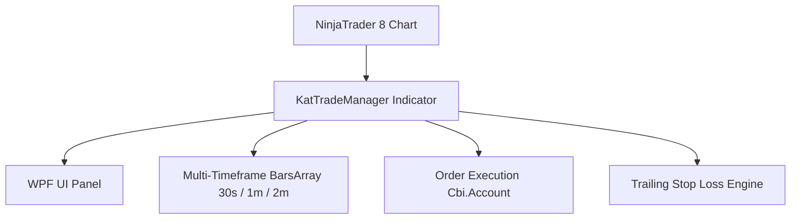

# Project Diary & Graphify Knowledge Base

## 📊 Graphify System Architecture

### Key Entities & Dependencies
- **Component**: `KatTradeManager` (NinjaTrader Indicator)
- **UI Framework**: WPF (`System.Windows.Controls`) on `ChartControl.Parent`
- **Execution Target**: `NinjaTrader.Cbi.Account` (`Sim301` or Active Account)
- **Supported Timeframes**: `Chart TF` (Bars 0), `30s` (Bars 1), `1m` (Bars 2), `2m` (Bars 3)

---

## 📜 Version History & Change Log

### [v0.04] - 2026-07-24
- **Fixed CS1061 `SetZIndex` Namespace Collision**:
  - Replaced ambiguous `Panel.SetZIndex(...)` with fully qualified `System.Windows.Controls.Panel.SetZIndex(...)` to prevent collision with NinjaScript's `Panel` integer property.
  - Redeployed clean `KatTradeManager.cs` to `Documents\NinjaTrader 8\bin\Custom\Indicators\KatTradeManager.cs`.

### [v0.03] - 2026-07-24
- **ChartTrader Integration & UI Placement**:
  - Embedded WPF panel directly into ChartTrader right-side panel below position display.
  - Added visual tree searching (`GetChartTrader()`, `FindVisualChild<T>()`) to locate ChartTrader container.
  - Added fallback docking to bottom-right of chart with `Panel.SetZIndex = 9999` so controls are never hidden.
  - Redeployed `KatTradeManager.cs` to `Documents\NinjaTrader 8\bin\Custom\Indicators\KatTradeManager.cs`.

### [v0.02] - 2026-07-24
- **NinjaTrader 8 API Fixes**:
  - Fixed `CS0118`: Removed indicator-incompatible `OrderFillResolution` assignment.
  - Fixed `CS0117`: Changed `Account.AllAccounts` to valid NT8 `Account.All`.
  - Fixed `CS1501`: Updated `Account.CreateOrder` 12-argument overload signature including `DateTime.MaxValue`.
  - Fixed `CS1061`: Corrected `order.State` to `order.OrderState`.
  - Fixed `CS1501`: Updated `Account.Change` overload to pass array of orders after mutating `StopPrice`.
  - Redeployed clean `KatTradeManager.cs` to `Documents\NinjaTrader 8\bin\Custom\Indicators\KatTradeManager.cs`.

### [v0.01] - 2026-07-24
- **Initial Release & Infrastructure**:
  - Created initial repository layout and `.gitignore`.
  - Added `RULES.md` & `.gemini/rules/project_rules.md` for automated versioning and release workflows.
  - Implemented `KatTradeManager.cs` with WPF control panel overlay.
  - Added pending stop placement at High/Low of Previous and Current candles across 30s, 1m, 2m timeframes.
  - Implemented Trailing Stop Loss engine and quick position management actions.
  - Deployed directly to NinjaTrader 8 (`C:\Users\kieuanhtuan\Documents\NinjaTrader 8\bin\Custom\Indicators\KatTradeManager.cs`).
