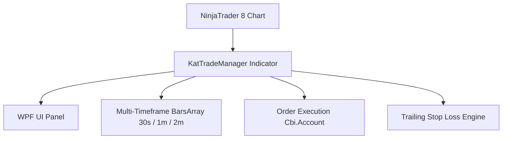

# Project Diary & Graphify Knowledge Base

## 📊 Graphify System Architecture

### Key Entities & Dependencies
- **Component**: `KatTradeManager` (NinjaTrader Indicator)
- **UI Framework**: WPF (`System.Windows.Controls`) on `ChartControl.Parent`
- **Execution Target**: `NinjaTrader.Cbi.Account` (`Sim301` or Active Account)
- **Supported Timeframes**: `Chart TF` (Bars 0), `30s` (Bars 1), `1m` (Bars 2), `2m` (Bars 3)

---

## 📜 Version History & Change Log

### [v0.11] - 2026-07-24
- **Fixed Button Press Errors (barsAgo & NullReferenceExceptions) & Synced Version**:
  - Replaced direct UI-thread `Highs`/`Lows` calls with thread-safe volatile caches updated via `OnBarUpdate` on the data thread.
  - Added verification that `basePrice > 0` before submitting stop orders to prevent default-price execution.
  - Implemented null reference protection on the returned `entryOrder` from `account.CreateOrder` before calling `account.Submit`.
  - Overwrote the running NinjaTrader 8 `KatTradeManager.cs` indicator file to resolve the version display mismatch (running v0.10 vs codebase v0.11).

### [v0.07] - 2026-07-24
- **Added `Show Control Panel` (`IsPanelVisible`) Property (Default: True)**:
  - Exposed `Show Control Panel` checkbox parameter in Indicator Settings dialog to easily toggle panel visibility on/off.
  - Fixed cross-instance deletion bug where instance A's destructor was deleting instance B's panel on Dispatcher execution.
  - Redeployed `KatTradeManager.cs` to `Documents\NinjaTrader 8\bin\Custom\Indicators\KatTradeManager.cs`.

### [v0.06] - 2026-07-24
- **Fixed 1-Second Disappearing Bug via Persistent `chartGrid` Container**:
  - Identified root cause: NinjaTrader's `ChartTrader` runs a 1-second internal UI refresh loop for PnL and position displays, which wipes out manually injected controls inside `ChartTrader`'s private children.
  - Attached `panelBorder` directly to `ChartControl.Parent` (`chartGrid`) with `SetZIndex = 9999` and `Grid.SetColumnSpan = 3`.
  - Added full mouse Drag-and-Drop capability (`MouseLeftButtonDown`, `MouseMove`, `MouseLeftButtonUp`) so users can move the control panel anywhere on the chart canvas.
  - Redeployed `KatTradeManager.cs` to `Documents\NinjaTrader 8\bin\Custom\Indicators\KatTradeManager.cs`.

### [v0.05] - 2026-07-24
- **Fixed WPF Panel Flashing & Disappearing on Re-adding Indicator**:
  - Target Vertical `StackPanel` instead of arbitrary first `StackPanel` (which picked horizontal sub-rows in ChartTrader).
  - Added Tag `KatTradeManagerPanel` and implemented `RemoveExistingPanels()` to clean up duplicate panels across instances.
  - Delayed control binding using `DispatcherPriority.Loaded` and added automatic re-attachment check on `State.Historical` & `State.Realtime`.
  - Redeployed `KatTradeManager.cs` to `Documents\NinjaTrader 8\bin\Custom\Indicators\KatTradeManager.cs`.

### [v0.04] - 2026-07-24
- **Fixed CS1061 `SetZIndex` Namespace Collision**:
  - Replaced ambiguous `Panel.SetZIndex(...)` with fully qualified `System.Windows.Controls.Panel.SetZIndex(...)` to prevent collision with NinjaScript's `Panel` integer property.
  - Redeployed clean `KatTradeManager.cs` to `Documents\NinjaTrader 8\bin\Custom\Indicators\KatTradeManager.cs`.

### [v0.03] - 2026-07-24
- **ChartTrader Integration & UI Placement**:
  - Embedded WPF panel directly into ChartTrader right-side panel below position display.
  - Added visual tree searching (`GetChartTrader()`, `FindVisualChild<T>()`) to locate ChartTrader container.
  - Added fallback docking to bottom-right of chart with `Panel.SetZIndex = 9999` so controls are never hidden.
  - Redeployed `KatTradeManager.cs` to `Documents\NinjaTrader 8\bin\Custom\Indicators\KatTradeManager.cs`.

### [v0.02] - 2026-07-24
- **NinjaTrader 8 API Fixes**:
  - Fixed `CS0118`: Removed indicator-incompatible `OrderFillResolution` assignment.
  - Fixed `CS0117`: Changed `Account.AllAccounts` to valid NT8 `Account.All`.
  - Fixed `CS1501`: Updated `Account.CreateOrder` 12-argument overload signature including `DateTime.MaxValue`.
  - Fixed `CS1061`: Corrected `order.State` to `order.OrderState`.
  - Fixed `CS1501`: Updated `Account.Change` overload to pass array of orders after mutating `StopPrice`.
  - Redeployed clean `KatTradeManager.cs` to `Documents\NinjaTrader 8\bin\Custom\Indicators\KatTradeManager.cs`.

### [v0.01] - 2026-07-24
- **Initial Release & Infrastructure**:
  - Created initial repository layout and `.gitignore`.
  - Added `RULES.md` & `.gemini/rules/project_rules.md` for automated versioning and release workflows.
  - Implemented `KatTradeManager.cs` with WPF control panel overlay.
  - Added pending stop placement at High/Low of Previous and Current candles across 30s, 1m, 2m timeframes.
  - Implemented Trailing Stop Loss engine and quick position management actions.
  - Deployed directly to NinjaTrader 8 (`C:\Users\kieuanhtuan\Documents\NinjaTrader 8\bin\Custom\Indicators\KatTradeManager.cs`).
